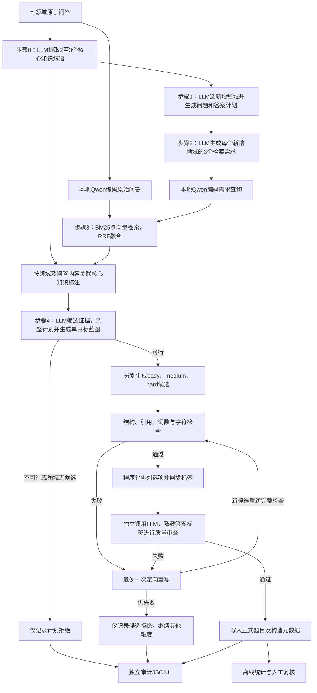

# v5 当前流程说明（2026-10-04 更新）

本文根据当前目录的 Python 实现、Shell 入口和共享检索代码整理。文件名保留 `CURRENT_WORKFLOW_20261001.md`，内容已更新为当前 v5 流程。所有运行目录与配置变量使用 v5 命名；本文记录现有实现及提示词结构整理后的状态，第 0–3 步算法、输入数据和已有结果保持不变，未启动模型生成。

当前流程保留 Instance-Conditioned Need-First 的第 0–3 步，第 4 步采用“证据筛选及单目标蓝图 → 简洁题目生成 → 程序检查 → 选项打乱 → 答案标签盲审 → 最多一次定向重写”。详细 CLI 与 schema 见 [第 4 步文档](4_generate_fusion_question.md)，运行配置见 [run_config.sh](run_config.sh)。

## 1. 总体流程与执行者



图中的重写有每个难度最多一次的计数限制，不是无限循环。API 或无效 JSON 重试属于客户端传输/解析重试，与候选重写分别处理。

| 环节 | 执行者 | 模型调用粒度 |
| --- | --- | --- |
| 步骤 0 核心知识摘要 | API 指定的 LLM | 每个原子问答一次逻辑调用 |
| 步骤 1 选领域与计划 | LLM | 每个源问答、每种总领域数一次 |
| 步骤 2 知识需求 | LLM | 每个计划一次，同时覆盖所有新增领域 |
| 文档与查询向量 | 本地 Qwen3-Embedding-8B | 向量编码，不调用生成 API |
| 步骤 3 检索与标注关联 | Python / NumPy / SQLite | 不调用 LLM |
| 步骤 4 筛选与蓝图 | LLM | 每个有完整检索候选的非重复计划一次 |
| 步骤 4 初稿 | LLM | 每个可行计划分别尝试三个难度 |
| 结构、长度、排列和通过判定 | Python | 不调用 LLM |
| 答案标签盲审 | LLM 独立调用 | 每个通过硬检查并已排列的候选一次 |
| 定向重写 | LLM | 每个难度初稿失败后最多一次 |
| 离线统计 | Python | 不调用模型 API |

## 2. 目录、入口与参数作用

默认配置由当前 v5 目录中的 `run_config.sh` 提供：

| 配置 | 默认值或作用 |
| --- | --- |
| `V5_ROOT` | 当前 `pipielines_v5/outputs`，读取及保存常规阶段结果 |
| `V5_CONCISE_ROOT` | 当前 `pipielines_v5/outputs_concise`，简洁入口的新题根目录 |
| `V5_CONCISE_AUDIT_ROOT` | 当前 `pipielines_v5/outputs_concise_audit`，简洁入口的审计根目录 |
| `ATOMIC_ROOT` | `knowledge/atomic` |
| `EMBEDDING_ROOT` | `knowledge/embeddings/v5-test-Qwen3-Embedding-8B` |
| `V5_SPLIT` | 脚本固定 `test`，不是直接读取同名环境变量 |
| `V5_DOMAINS` | medical、legal、financial、mathematics、computer_science、geography、chemistry |
| `V5_DOMAIN_COUNTS` | 2、3、4，包含源领域；底层 CLI 支持总领域数 2–7 |
| `NUM` | 默认 100，`all` 表示不传输入数量限制 |
| `TOP_K` / `CANDIDATE_LIMIT` | 每查询每方法 top 10 / 每新增领域最终最多 10 条候选 |
| `GPU_ID` / `EMBEDDING_DEVICE` | 默认 0 / auto，编码时自动选择可用 CUDA 或 CPU |
| `EMBEDDING_BATCH_SIZE` | 默认 8 |

Python 优先使用本目录 `.env/bin/python`，其次是本机 `crossx` 环境，最后是 `python3`。API 参数来自 `API_BASE_URL`、`API_KEY`、`MODEL`，不得将真实密钥写入文档或结果。单步附加参数放在配置文件的 `STEP_0_ARGS`、`STEP_1_ARGS`、`STEP_2_ARGS`、`STEP_4_ARGS`、`EMBEDDING_ARGS`、`RETRIEVAL_ARGS` 数组中。

| 入口 | 实际执行内容 | 输出位置与数量限制 |
| --- | --- | --- |
| [run_0.sh](run_0.sh) | 七领域原子 test 全量知识摘要 | `V5_ROOT/0_extract_key_facts`；不读取 `NUM` |
| [run_1.sh](run_1.sh) | 21 组领域选择及计划生成 | `V5_ROOT/1_generate_fusion_plans`；`NUM` 限制每组源问答数 |
| [run_2.sh](run_2.sh) | 消费已有第 1 步计划 | `V5_ROOT/2_extract_required_key_facts`；不另传数量限制 |
| [run_3.sh](run_3.sh) | 编码原始语料和需求查询，再执行 21 组检索 | `V5_ROOT/3_retrieve_key_fact_matches`；不另传数量限制 |
| [run_4.sh](run_4.sh) | 调用当前第 4 步 Python 实现 | `V5_ROOT/4_generate_fusion_question`；不读取 `NUM`，默认审计为同目录 sidecar |
| [run_4_concise.sh](run_4_concise.sh) | 仅重跑当前第 4 步，读已有第 3 步 | 新题与审计分别写入独立根目录；`NUM` 限制每组输入计划数 |
| [run_all.sh](run_all.sh) | 使用已有第 0、1 步，依次运行第 2、3、4 步 | 调用的是 `run_4.sh`，不调用独立简洁入口，不重跑第 0、1 步 |

两个第 4 步 Shell 入口调用同一个当前 Python 实现，都会默认执行简洁构造和盲审；区别在输出目录隔离、审计路径、数量限制以及独立入口提供的 `MAX_REPAIRS` / `SEED` 环境覆盖。不能把 `run_all.sh` 理解为“只重跑第 4 步”。

第 0 步文件为 `<domain>/test.jsonl`；第 1–4 步分组文件为 `<domain>/test_domain_count_<N>.jsonl`。`N` 包含源领域，与固定四个选项无关。`NUM=3` 用于简洁批入口时是每组 3 计划、共最多 63 计划，不是总计 3 计划的 smoke。

## 3. 当前数据快照与输入完整性

2026-10-04 使用与共享 `read_rows()` 一致的文件逐行读取方式检查，当前数据如下。不能用 `str.splitlines()` 统计 JSONL 记录：问答文本可能包含 Unicode 行分隔符，该方法会将合法 JSON 字符串拆成多个片段。

| 目录 | JSONL 文件数 | 非空 JSONL 记录 | JSON 解析失败 |
| --- | ---: | ---: | ---: |
| `knowledge/atomic/*/test.jsonl` | 7 | 1442 | 0 |
| `outputs/0_extract_key_facts` | 7 | 1441 | 0 |
| `outputs/1_generate_fusion_plans` | 21 | 2100 | 0 |
| `outputs/2_extract_required_key_facts` | 21 | 2100 | 0 |
| `outputs/3_retrieve_key_fact_matches` | 21 | 2100 | 0 |

第 1–3 步每个分组文件都有 100 条记录。第 3 步文件齐全，2100 条均可按 JSONL 读取；程序仍会在处理各行时验证领域、计划、三短语需求及候选样本结构。原子语料与第 0 步条数不同，不能据此认定所有原子问答都有核心知识标注；第 3 步会记录并排除没有对应标注的候选。

批入口预检检查文件存在性、输出冲突和路径别名，不预先验证全部输入行。一般情况下，后续行出现非法 JSON 或 schema 错误会中止该组；本次快照的文件可解析，不等于其知识事实、检索支持或融合可行性已经验证。

核对时 `outputs_concise` 和 `outputs_concise_audit` 尚不存在，没有本目录新流程的真实生成结果可用于接受率或长度改善统计。现有第 0–3 步记录中的 `model` 是保存的配置标识，不据此推断服务商实际底层模型；第 3 步顶层 `model` 继承上游，不代表检索调用了该生成模型。本次没有改写任何输入或结果文件。

## 4. 第 0–2 步：源知识、计划与检索需求

第 0 步实现为 [0_extract_key_facts.py](0_extract_key_facts.py)。LLM 同时读取原 prompt 和 completion，摘要为 2–3 个不同的短英文知识短语。输出保留完整 `sample`、`source_file`、`source_line`、`source_domain`、`model` 和 `key_facts`。这不是重新解题；结构校验也不保证源答案正确。Shell 默认处理全部原子 test，原子语料不变时可复用已有标注。

第 1 步实现为 [1_generate_fusion_plans.py](1_generate_fusion_plans.py)。输入包括源问答、核心知识、其余六领域介绍和总领域数。模型选择恰好 N−1 个不同新增领域，输出字符串 `question_plan` 和四类 `answer_plans`：correct、missing_domain_knowledge、parallel_knowledge、incorrect_domain_relation。这里尚未查看实际检索证据，也不生成完整题面；`question_plan` 不是旧版 objective / conditions / domain_roles 的嵌套对象。

每个源问答、每种领域数量只设计一个组合，不枚举全部领域组合。若七领域每组均能读取 100 个源问答，默认是 7×3×100=2100 个计划；这是输入规模，不是第 4 步接受题数。`NUM` 取前若干输入，不是随机抽样。

第 2 步实现为 [2_extract_required_key_facts.py](2_extract_required_key_facts.py)。每个计划一次 LLM 调用，为每个新增领域生成恰好三个不同 `key_fact` 短语及对应 `necessity`。源领域不追加检索需求；N=2/3/4 时，每计划分别有 3/6/9 个查询需求。程序硬校验数量、领域覆盖、非空及去重，实际检索仅使用短语，necessity 保留为构造说明。

这些短语是待寻找的知识需求，不是证据。第 4 步可以根据所选真实材料重写计划和需求，但不能通过把需求直接作为题干规则，伪造证据充分性或削弱被测知识。

## 5. 向量准备与第 3 步混合检索

[run_3.sh](run_3.sh) 先调用共享 `knowledge/pipelines/embed_knowledge.py --kind corpus` 编码原始问答，再调用本目录 [embed_required_key_facts.py](embed_required_key_facts.py) 编码第 2 步查询。适配器只改变输入读取，复用共享编码器与缓存；同一 `(domain, query)` 去重。

默认本地模型为 `Qwen/Qwen3-Embedding-8B`，batch size 8；编码器默认块长 2048 tokens、重叠 128 tokens，取最后非 padding token 的表示并 L2 归一化。文档编码和 BM25 使用原始 prompt/completion，不使用第 0 步短语替代全文。长问答按 token 分块，语义得分取候选各块的最大余弦。文档与查询向量及兼容配置保存在 embedding-root 的 `vectors.sqlite3`，兼容缓存会复用；默认根目录名称不表示该库当前已经建好。

第 3 步实现为 [3_retrieve_key_fact_matches.py](3_retrieve_key_fact_matches.py)，复用共享检索器。对每个新增领域的三个 query，分别执行 BM25 和预计算向量检索：

1. 每种方法先取 `top_k + 1`，按规范化源问答哈希剔除相同样本，再保留每查询每方法最多 top 10。
2. 在同一领域内跨查询、跨方法按 `sum(1/(60+rank))` 做 RRF，合并去重后默认最多 10 条候选。
3. 用领域和规范化问答内容关联第 0 步标注，附加 `key_facts`；无标注候选跳过并记入 `skipped_unannotated_candidates`，不自动补位。

输出 `retrieved_samples` 保存候选 ID、原问答、核心知识、来源、`rrf_score`、`hits` 和 `matches`，`retrieval` 保存方法、向量配置与参数。`matches` 只是查询命中记录，不能证明该材料支持对应需求。

BM25 只保留正分候选；向量检索没有额外最低相似度门槛。RRF 根据排名，不做 LLM 证据判断或重排序。单独运行检索 Python 时只读取已有向量，不加载编码模型；运行 `run_3.sh` 则包含前面的向量准备。候选列表非空或满额都不等于证据充分。

## 6. 第 4 步：筛选、简洁构造与质量门控

实现由 [4_generate_fusion_question.py](4_generate_fusion_question.py)、[_concise_prompts.py](_concise_prompts.py) 和 [_concise_fusion.py](_concise_fusion.py) 组成。

四类提示词统一分为 Tasks、Requirements、Output Format、Example，分别说明当前阶段的工作、约束、JSON 契约和静态样例。筛选、生成、盲审、重写各有独立任务；重写通过代码复用生成约束和 schema，不拼接整段生成提示词。样例仅说明如何保留目标、引用和标签关系，不能替代实际生成质量验证。

**筛选与蓝图。** 验证第 3 步原记录，按领域读取候选原 prompt/completion；候选 ID、RRF 分数和命中标注不传给构题模型。任一新增领域无候选则直接跳过；重复输入报告 duplicate。其余计划进行一次筛选调用，同时选择精确 `selected_samples`、调整 `question_plan` / `answer_plans` / `required_key_facts`，生成 `compact_blueprint`。不增加单独规划调用，不重新检索，不更换领域。

蓝图包含 `target`、`answer_form`、`dependency_summary` 及覆盖源领域和全部新增领域的 `domain_roles`。answer_form 为 number、decision、short_text、expression、code 之一；各领域角色含 knowledge、role、removal_effect。默认 target 最多 20 词、依赖说明最多 70 词、每个角色字段最多 35 词，可通过预算文件覆盖。

收缩的是最终回答对象，全部领域仍须参与决定结果；不能把多个独立子问藏进 report、tuple 或清单。证据不能支持自然联合目标时返回 `feasible=false`，每域选中样本为空，计划及蓝图均为 null。可行时 selected_samples 和三短语需求只覆盖新增领域，引用必须是该领域真实供应的原问答。

**生成与硬检查。** 对可行计划分别尝试 easy / medium / hard，每次只发送筛选后的证据、修改后的计划、蓝图与预算。题干保留必要实例条件和一个最终问题；四个选项以相同语义形式提供结果，不用错误标签或长解释充当选项。通用被测规则与整条知识桥接关系不应直接赠送，但局部 API 约定、单位、边界、精度等实例条件要给全。

程序校验四个不同选项、合法答案、三类错误各一次、三个错误选项各被注释一次，并核对 `used_samples` 精确来源及新增领域覆盖。引用使用 prompt/completion，不使用旧版 `used_material_ids`。合法多行代码只去首尾空白；code / expression 的比较保留有意义的缩进与标识符大小写。解释中无法安全映射的明确选项字母引用会触发重写，不全局替换代码变量 A/B/C/D。

默认英文词数口径为 `len(text.split())`，只统计 question/options，不计选项字母和后台元数据：

| 总领域数 | 题干软目标 | 题干硬上限 | 每选项硬上限 | 总可见硬上限 |
| --- | --- | --- | --- | --- |
| 2 | 30–55 | 75 | 18 | 130 |
| 3 | 40–70 | 95 | 20 | 160 |
| 4 | 50–85 | 115 | 22 | 190 |

软目标不是拒绝条件，短数字选项没有最小词数。单字段及总字符上限默认相应词数上限 × 12，防止去空格绕过。5–7 域按线性外推预算并标 `uncalibrated_extension`。预算是本项目工程选择，不是外部 benchmark 官方参数。同领域数三个难度共用预算，不靠加背景或独立子问体现难度。超限提供字段、实际长度和上限，绝不截断代码、删除必要条件或丢弃领域。

**程序化排列。** 每个通过硬检查的新候选在盲审前只排列一次，同步移动选项文本、answer 和 distractor_analysis.option，保存 old→new 映射。plan_key 优先使用 upstream plan_id，否则由源问答、源领域、排序领域集合及原问题/答案计划确定性 SHA256；item_id 由版本、plan_key、difficulty 生成。排列种子由用户 seed 与 item_id 派生，不使用路径或 Python hash()。默认 seed=42；只保证排列可复现，不保证远程生成一致或小分层严格均衡。

**答案标签盲审。** 独立模型调用看到最终 question/options、参与领域、源样本和所选证据；看不到拟定 answer、解释、错误分析、计划或蓝图。默认复用生成模型配置，也可用 `--judge-model` 指定同端点另一模型。它是允许查证证据的盲审，不是闭卷能力测试；证据不能补齐题面遗漏的实例条件。

程序计算通过条件，而不采信模型一句 overall_pass：

- correct_options 恰好为拟定答案的单元素列表，零答案、多答案、答案冲突均失败。
- single_target、self_contained、evidence_grounded、no_knowledge_giveaway、same_answer_form、no_surface_shortcut 六项全部 pass，uncertain 不通过。
- 每个领域，包括源领域，necessary=true，且 issues 为空。只提及领域术语或情境不算必要贡献。

答案冲突不直接更换答案键。三类错误标签属于构造者意图，`error_label_status=construction_intent`；默认盲审不从简短错误结果唯一诊断其认知机制。解释仍应说明错误步骤如何产生该结果，机制合理性需要另行人工或专门审查。

**最多一次重写。** 初稿硬检查或盲审失败，将原候选、具体问题、选中证据、蓝图、预算和必须保留的知识约束发送给 REPAIR_PROMPT。语义反馈附已排列候选和映射，避免标签混淆。重写得到新未排列对象，重新执行全部检查、排列和盲审。仍失败只记审计，继续其他难度；同一计划最多三道接受题，不强制凑齐。

## 7. 保存字段、审计和失败处理

正式行保留原 source_file、source_domain、model、sample、key_facts、fusion_domains、domain_count、question_plan、answer_plans、required_key_facts、retrieved_samples、retrieval，以及 question、options、answer、explanation、distractor_analysis、used_samples、plan_adjustment、difficulty。顶层计划为筛选后版本；全部检索问答及原 retrieval 元数据保留，实际生成引用只允许来自 selected_samples。

新增 `item_id` 和 `construction`：版本 `v5-concise-1`、plan_key、上游物理行、原计划及知识需求、蓝图、选中证据、长度预算与统计、scope_change、模型标识、repair_count、seed、排列映射、审查结果与状态。计划有变化时保守标为 target_narrowed，比较时称“同源计划重构”，不宣称严格等价文字压缩。difficulty_status 为 uncalibrated；跨难度完全相同的题干与无序选项标 duplicate_difficulties，近重复仍需人工识别。

审计记录筛选 passed / rejected / duplicate，以及每个难度每次候选 accepted / repairing / rejected、原因、原稿、已检查候选、长度、排列、审查结果和运行配置。部分运行时故障记录 fatal_error。`--skip-semantic-audit` 仅供格式调试，会警告并标 not_run；这些行可写入调试输出，但不能计为质量通过。

共享 JSONAPI 使用兼容 `/chat/completions` 的接口，temperature=0、response_format=json_object。默认 retries=2 是最多 3 次传输/解析尝试；可重试连接/超时、部分 HTTP 和 JSON/schema 错误，普通不可重试 4xx 立即失败。第 4 步生成对象的结构或长度问题进入质量重写，筛选/审查 schema 失败沿用客户端重试，重试耗尽明确报错。

默认 timeout：第 0 步 120 秒，第 1、2、4 步 180 秒；max_tokens 分别为 256、2048、2048、4096。第 4 步 max_tokens 控制完整生成 JSON，max-input-chars=160000 控制每次 API 载荷，均不等于题干词数预算。超长 API 输入明确报错，不静默截断任何证据或代码。

所有 LLM 调用按组、按行、按难度串行；当前没有并发、全局限流、真正断点续传或自动失败队列。每条输出立即 flush，故障保留已完成内容。默认拒绝覆盖正式和审计文件，`--overwrite` 从头重写，不是 append。独立简洁入口在首个模型调用前预检全部组的输入/输出/审计路径，三个根目录必须不同。单步 Python 未显式指定 audit-output 时使用同目录 `.audit.jsonl` sidecar，评测时必须排除。

运行报告区分 processed、skipped、feasible_plans、initial_candidates、repair_candidates、accepted、debug_accepted、generated、final_rejected、duplicate_plans 和 logical_api_calls。共享客户端不暴露成功调用内部实际传输尝试次数，transport_attempts 标 not_exposed_by_shared_JSONAPI；审计只保存 retry 配置上限，不伪造实际请求计数。当前也未统一保存 token 用量、费用和逐请求耗时。

## 8. 运行命令与调用规模

以下命令是运行说明，本次文档更新未执行。当前第 3 步的 21 个输入文件已齐全；模型生成是否可行、质量门控是否通过仍由实际运行决定。

只重跑第 4 步：

```bash
cd /mnt/data1/wangyatong/cross-x
API_BASE_URL="https://your-provider/v1" \
API_KEY="your-key" \
MODEL="your-model" \
NUM=all bash knowledge/pipielines_v5/run_4_concise.sh
```

若需显式覆盖根目录，使用 V5_ROOT、V5_CONCISE_ROOT、V5_CONCISE_AUDIT_ROOT；默认值都由当前 v5 脚本目录推导。覆盖已有新题和审计时在入口末尾加 `--overwrite`。MAX_REPAIRS 默认 1（只允许 0 或 1），SEED 默认 42；其他第 4 步参数放 STEP_4_ARGS 或直接调用 Python。

总计三个输入计划的单组 smoke：

```bash
python knowledge/pipielines_v5/4_generate_fusion_question.py \
  --input knowledge/pipielines_v5/outputs/3_retrieve_key_fact_matches/mathematics/test_domain_count_2.jsonl \
  --output knowledge/pipielines_v5/outputs_concise/4_generate_fusion_question/mathematics/smoke3.jsonl \
  --audit-output knowledge/pipielines_v5/outputs_concise_audit/4_generate_fusion_question/mathematics/smoke3.audit.jsonl \
  --domain-count 2 --num 3 --max-repairs 1 --seed 42
```

该 Python 命令沿用已配置的 API 环境变量。`--num 3` 限制三个输入计划，最多九道初稿，不因重写增加输入计划数。

如需重跑第 2、3、4 步，使用 `bash knowledge/pipielines_v5/run_all.sh`；它要求已有第 0、1 步及原子语料，会执行编码/检索并写入常规 outputs，而非简洁独立输出。当前这些目标已存在时，不带 overwrite 会在预检阶段停止。

设 P 个有效非重复计划全部可行，三种难度均一次生成并通过硬检查和盲审，则只跑第 4 步需 7P 次逻辑调用：每计划 1 筛选 + 3 生成 + 3 审查。三个输入计划为 21 次，若有 2100 个此类计划则为 14700 次；这些是条件估算，不是当前实测数量或费用。筛选拒绝减少调用，重写及客户端重试增加调用。

若每个难度都重写一次且所有初稿/重写稿均通过硬检查进入盲审，每计划至多 13 次第 4 步逻辑调用（1 + 3×4），不含底层 API 重试。全新跑第 0–4 步且上述一次通过条件成立，LLM 逻辑调用约 A+9P；复用第 0、1 步但重跑第 2–4 步约 8P。向量编码另计。

## 9. 离线统计与评测输入

[audit_step4_concise.py](audit_step4_concise.py) 不调用模型 API。读取新旧题目目录，并从独立 audit-root 统计筛选、重写、拒绝、调试输出及故障。按源领域、总领域数、难度和审查状态报告题干/选项/总可见长度的均值、中位数、P95、超限率、答案位置与构造错误类型位置；接受率的分母是初始候选数，修复不是新样本。零接受显示 0/N，长度不可用为 null；未提供 audit-root 时接受率不可用。

匹配使用源问答、领域集合、原计划身份和 difficulty，不靠两个文件同行。旧行缺少原计划标识时可回查共同第 3 步或提供显式匹配清单；无法唯一关联标 ambiguous / unmatched，不强行配对。成功匹配的长度变化存在接受/拒绝选择偏差，target_narrowed 只能称同源计划重构。

```bash
python knowledge/pipielines_v5/audit_step4_concise.py \
  --old-root /absolute/path/to/previous/4_generate_fusion_question \
  --new-root knowledge/pipielines_v5/outputs_concise/4_generate_fusion_question \
  --audit-root knowledge/pipielines_v5/outputs_concise_audit/4_generate_fusion_question \
  --upstream-root knowledge/pipielines_v5/outputs/3_retrieve_key_fact_matches \
  --output /tmp/step4_concise_report.json
```

需先有真实新旧结果及合法的共同输入；当前没有新流程输出，不能据空目录给出有效长度对比或接受率。统计输出拒绝覆盖已有报告。

被测模型输入必须使用 `_concise_fusion.visible_item(row)` 白名单，只包含 question/options，再附统一答题指令。answer、解释、蓝图、证据、错误标签和审查结果只能用于评分或溯源，不能全量序列化输出行发给被测模型。盲审允许私有证据查证，而正式评测不提供这些证据，两者用途不同。

## 10. 已验证与尚未验证

2026-10-04 提示词结构整理后，v5 离线测试 46/46 通过，覆盖原流程回归、蓝图/引用约束、结构与预算、代码格式、稳定 ID 和排列同步、盲审防泄漏、一次重写/最终拒绝、API 故障、路径保护、NUM 计数和统计匹配，以及新增的静态提示词示例契约和代码结果检查。此前单独的流程文档更新未运行生成；本次提示词整理也未重新生成真实题目。

```bash
PYTHONDONTWRITEBYTECODE=1 /mnt/data1/wangyatong/anaconda3/envs/crossx/bin/python \
  -m unittest discover -s knowledge/pipielines_v5/tests -v
```

离线 mock 只验证工程控制流，不证明生成事实正确、答案唯一或跨领域依赖成立。核对时未发现本目录简洁流程的真实模型输出，真实接受率、长度改善、难度校准、近重复、5–7 域预算及三类错误机制的人工合理性尚未验证。一次 LLM 盲审也不是独立专家确认，不能证明所有模型都无法走捷径。

原文中旧批次“210 题、32/210 保留”的人工审阅统计、历史目录和旧入口已从当前流程说明移除，不能用作 v5 接受率或当前自动审查能力的证据。当前可执行门控就在第 4 步内部，无需额外启动一个历史“步骤 3.5”脚本。

实际提示词来自 Python 文件及 `_concise_prompts.py`；双语 Markdown 是说明副本，不由运行脚本读取。改变代码中的提示词或 schema 时，需同步对应文档和测试。
