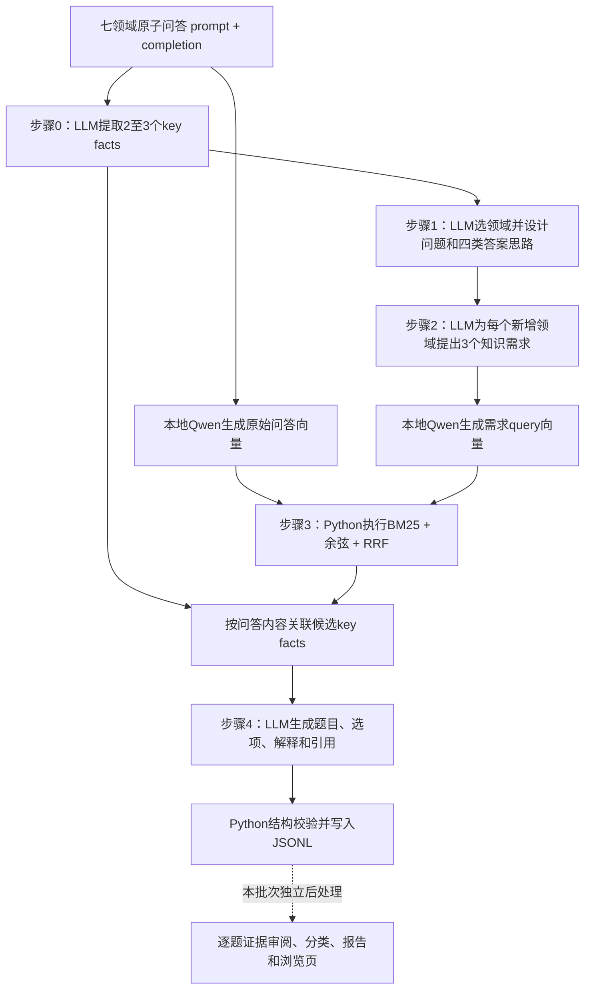

# 2026-10-01 的 v2 流程记录

本文是复制 v2 时保留的历史记录；v4 的当前入口和配置见 [run_serial.md](run_serial.md)。下文的旧脚本名、输出路径和阶段行为不代表当前 v4。

核对日期：2026-10-01。以当前 Python 和 Shell 代码为准；本文记录现状，不修改生成逻辑、不启动生成。

## 1. 总体流程与执行者



| 环节 | 执行者 | 是否调用生成模型 |
| --- | --- | --- |
| 原子知识摘要 | API指定的LLM | 是，每条原子样本一次成功请求 |
| 领域选择和方案 | API指定的LLM | 是，每条源样本、每种总领域数一次 |
| 所需知识提取 | API指定的LLM | 是，每个方案一次，覆盖所有新增领域 |
| 文档和query向量 | 本地Qwen3-Embedding-8B，PyTorch/Transformers | 否，执行向量编码 |
| 召回、排序和标注关联 | Python、NumPy、BM25、SQLite向量库 | 否 |
| 最终题目生成 | API指定的LLM | 是，每个方案一次 |
| 字段校验与文件写入 | Python | 否 |
| 现有210题证据筛选 | 本次会话逐题语义审阅；Python按显式结论重建报告 | 未接入自动生成链 |

当前 `knowledge/outpupts` 中，0、1、2、4步保存的模型字段均为 `gt-6-as-a`。这只是服务返回/运行配置中的模型名称，不据此推断供应商实际底层模型。步骤3顶层model继承上游，不表示检索调用了该LLM。

## 2. 输入数据和生成数量

原子问答位于 `knowledge/atomic/<domain>/test.jsonl`，每行至少包含prompt和completion。七领域为medical、legal、financial、mathematics、computer_science、geography、chemistry。

当前统一入口固定 `V2_SPLIT=test`；该变量不是直接由同名环境变量覆盖。七领域原始test共1,442条，现有outpupts步骤0标注为1,441条，二者相差1条。不能将已有标注视为全量原始语料完全覆盖；步骤3会跳过无标注候选并记录。

`NUM=10` 控制步骤1每组顺序读取前10条有效输入，不是随机采样。总领域数组为2、3、4；每条源样本、每个数量生成一个组合，不枚举所有组合，也不生成多个备选方案。因此默认是7×3×10=210个方案。同一源题可能在三种领域数量下各出现一次。

N包含源领域：N=3时fusion_domains有2项，domain_roles有3项。N与四个答案选项数量无关。步骤1底层支持2至7领域，统一入口目前只跑2、3、4。

## 3. 步骤0：已有问答的知识摘要

实现：`0_extract_key_facts.py`。

输入：原始prompt和completion。模型同时读取答案，以识别正确知识，避免把干扰项概念当作核心。

输出：2至3个简短英文关键词组key_facts，保留完整原样本、source_file、source_line、source_domain、model。

例：IPv4首部长度是否可变 → IPv4 packet header / variable header length。

代码检查关键词数量、非空和去重；没有独立事实核查，不保证源答案正确。它是在摘要已有知识，不是替原题重新求解。

统一run_012总是对全部test执行此步，NUM不会限制它。原子语料不变时可复用已有结果，但统一入口不会自动跳过已有步骤0输出。

## 4. 步骤1：选领域、设计任务和答案结构

实现：`1_generate_fusion_plans.py`；实际提示词在脚本SYSTEM_PROMPT。

输入：源领域、完整原样本、key_facts、其余六领域的名称与介绍、domain_count。此时还没有查看这些领域真正能检索到什么材料。

LLM执行：

1. 选择恰好N−1个新增领域，不包含源领域，不重复。
2. 设计一个共同任务，保留源样本核心知识，要求各领域有必要贡献。
3. 输出question_plan：objective、conditions、domain_roles（role和knowledge_needed）、reasoning_link。
4. 同时输出四类answer_plans：correct、missing_domain_knowledge、parallel_knowledge、incorrect_domain_relation。

这里还不写完整题干和最终选项。程序检查领域数量、覆盖、类型及必要字段，但不会验证方案是否自然、跨领域是否真正必要、后续是否能找到材料。

重要影响：任务和干扰项机制在检索之前已确定。检索不能支持方案时，下游容易补规则、添加情节或更换任务。

## 5. 步骤2：将方案拆成检索需求

实现：`2_extract_required_key_facts.py`。

输入：源样本、key_facts、fusion_domains、question_plan、answer_plans。

每个新增领域生成恰好3项：

- key_fact：用于检索的知识短语，可以是概念、规则、机制或关系。
- necessity：为什么需要。

每个方案只进行一次LLM请求，不是每领域一次。N=2/3/4时分别产生3/6/9个查询需求。源领域不在此步追加检索需求。

恰好3项是 `_pipeline_common.py` 的硬校验，不只是一句提示。necessity用于保存和解释；实际检索query只使用key_fact字段。

required_key_facts是待寻找的知识需求，不是已验证事实。程序目前不阻止步骤4将它当作题干规则使用。

## 6. 向量准备：文档与需求分别编码

实现：原版 `../pipelines/embed_knowledge.py`、`../pipelines/_offline_embeddings.py`，以及v2适配器 `embed_required_key_facts.py`。

文档向量输入是原始prompt与completion，不是步骤0的key_facts。BM25也检索原始问答。key_facts在召回之后作为标注附上。

query是步骤2的key_fact，加入检索指令及目标领域。相同(domain, query)会去重。默认本地模型Qwen/Qwen3-Embedding-8B，batch size=8，最大块长2048 tokens，重叠128 tokens；取最后非padding token的表示并L2归一化。

长问答按token分块，不只保留开头。检索时整道候选的语义分数取所有块的最大余弦。一个局部片段相似不代表完整问答支持需求。

文档、query、向量缓存及模型配置保存在同一个embedding-root下的vectors.sqlite3。模型版本、tokenizer、分块和指令等配置须兼容。向量有缓存；改需求只需补充新的query向量。更换模型/语料时不能混用旧配置。

当前run_embedding_retrieve默认GPU_ID=1，通过CUDA_VISIBLE_DEVICES映射后，EMBEDDING_DEVICE=cuda:0实际指向所选可见卡；默认使用crossx环境中的Python。实际可用设备仍需运行前检查。

## 7. 步骤3：混合检索与key facts关联

v2实现：`3_retrieve_key_fact_matches.py`，复用原版 `../pipelines/3_retrieve_knowledge.py`。

对每个新增领域、每个query：

1. BM25对问答全文检索，保留正分候选。
2. 归一化向量点积计算余弦，对每条问答取最高分块得分。
3. 两种方法分别取top10；代码先多取1条以留出剔除源题重复的空间。
4. 按规范化问答哈希排除与源题相同的样本。
5. 在该领域内跨query、跨方法做RRF：sum(1/(60+rank))，合并去重后最多20条。
6. 用领域和规范化问答内容匹配步骤0标注，附加key_facts。没有标注则跳过，并记入skipped_unannotated_candidates；不会自动补位。

输出retrieved_samples中保存candidate_id、原始问答、key_facts、来源、rrf_score、hits、matches。matches只是记录哪个query命中了它，不是“已证明支持该知识需求”。retrieval保存模型、向量库、语料与检索参数。

此步不调用LLM、不加载embedding模型、不执行语义证据审查；NumPy在内存中进行全量向量点积，不是近似向量索引。

当前没有最低相似度门槛、没有重排序模型、没有核心需求覆盖检查。RRF仅依据排名。非空/满额候选列表不代表检索成功。

## 8. 步骤4：生成最终四选一题

实现：`4_generate_fusion_question.py`。

输入包含原样本、key_facts、所选领域、完整方案、四类答案思路、所有需求，以及全部保留候选的完整问答与标注。默认每个新增领域最多20条，N=4时最多约60条候选进入生成上下文。

模型输出：question、options(A–D)、answer、explanation、distractor_analysis、used_material_ids、plan_adjustment。

要求保留所选领域；四选项分别对应正确和三类错误；每个新增领域至少使用一条候选。发生实质改题时解释plan_adjustment。当前没有独立的“证据不足，跳过此题”响应分支。

程序执行结构校验：四个非空不同选项、答案标签合法、三类干扰项各一次、所指选项不是正确项、缺失领域合法、引用ID真实且覆盖新增领域。

仍有校验细节待加强：三种错误类型不能保证引用了三个不同的错误选项，当前校验没有专门核对这一集合；也不检验引用内容是否支持事实、答案是否唯一、领域是否不可替代、错误语义是否符合标签。

默认输入上限160,000字符，不是token数，超过就报错，不自动截断或压缩。默认输出max_tokens=4096，没有独立题干词数限制。

输出保留所有上游方案与候选，因此文件较大。model只记录当前步骤，未完整保留每个生成阶段模型版本。步骤1起不继续保存步骤0的source_line；批量追踪应补稳定sample_id/plan_id及分阶段配置。

## 9. LLM调用及失败处理

共用客户端：`../pipelines/_knowledge_search_common.py`。

- 用API_BASE_URL、API_KEY、MODEL配置兼容/chat/completions的接口。
- system为脚本内提示词，user为样本JSON；temperature固定0，response_format=json_object。
- 默认max_tokens：步骤0为256，步骤1/2为2048，步骤4为4096。
- 默认timeout：步骤0为120秒，其余180秒。
- retries=2表示最多尝试3次。连接错误、超时、部分HTTP错误及JSON/schema失败会重试；默认等待1秒和2秒。大多数其他4xx立即失败。
- schema失败是重新请求同一提示词，不是把具体错误反馈给模型进行修复。
- 每条成功记录立即flush。最终失败停止当前脚本和串行入口，已完成行保留。
- LLM调用逐条串行，没有并发、全局限流、自动失败队列或真正的断点续跑。
- 默认拒绝覆盖已有输出；--overwrite从头重写该段，不是接着处理剩余样本。
- 现有客户端不保存token用量、费用、逐请求耗时与完整模型配置快照。

## 10. 三个入口和实际配置差异

| 入口 | 工作 | 当前未显式设置V2_ROOT时的默认值 |
| --- | --- | --- |
| run_012.sh | 全量步骤0 → 21组步骤1 → 21组步骤2 | knowledge/pipelines_v2/outputs |
| run_embedding_retrieve.sh | 语料向量 → query向量 → 21组检索 | cross-x/run_012_joyrouter_20260922 |
| run_4.sh | 21组最终生成 | knowledge/outpupts |

三者默认目录并不统一：后两个入口在source run_config.sh之前已设置自己的V2_ROOT。旧run_serial.md关于统一默认目录的说明与代码不完全一致。未来批量运行应显式export同一个V2_ROOT，或修改入口消除覆盖。

集中配置 `run_config.sh` 中：V2_DOMAINS和V2_DOMAIN_COUNTS是数组，V2_SPLIT固定test；NUM、目录、模型、batch等多为环境变量回退。STEP_0_ARGS、STEP_1_ARGS、STEP_2_ARGS、STEP_4_ARGS、EMBEDDING_ARGS、RETRIEVAL_ARGS用于附加参数。

统一入口只接受--overwrite，不能直接追加--max-tokens之类参数。底层单步Python支持独立输入输出，适合复用步骤0或只重跑某个阶段。

未启动的示意命令：

```bash
cd /mnt/data1/wangyatong/cross-x
export V2_ROOT=/mnt/data1/wangyatong/cross-x/knowledge/runs/new_batch
# 另配置API_BASE_URL、API_KEY、MODEL及合适的embedding配置
NUM=all bash knowledge/pipelines_v2/run_012.sh
bash knowledge/pipelines_v2/run_embedding_retrieve.sh
bash knowledge/pipelines_v2/run_4.sh
```

上面每行是独立命令；若要失败自动阻止后续阶段，应使用set -e的包装脚本或按文档用&&连接。

## 11. 本次后处理并不是自动步骤3.5

`knowledge/step4_organized_20260930` 内的分类是针对已有210题的离线审阅：材料充分32，不充分178，其中146存在核心知识缺口、32发生实质换题。充分组仍有8题被旧内容抽查标记问题。

`audit/review_decisions.py`保存逐题显式标签；`audit/build_retrieval_report.py`检查上游一致性并按标签重建分组、索引、报告与浏览页。它不会调用模型为新样本判定相关性，也不是可直接拿去审阅几万条新题的自动筛选器。

当前流程仍然是3→4，没有生成前的自动证据门槛，也没有生成后的自动内容验收。之前只整理了结果，未修改pipelines_v2的运行逻辑。

## 12. 批量规模估算和优先调整项

设步骤0处理A条原子样本，步骤1生成P个方案。无重试、无筛选时，LLM成功请求数=A+3P（步骤0、1、2、4）；向量编码另算。

默认210方案对应步骤1/2/4合计630次成功请求。若全新运行完整1,442条test，且每条分别构造2、3、4领域方案，则P=4,326，LLM成功请求总数=14,420。这个数字是请求数，不是费用；重试会增加实际请求。已有1,441条标注若直接复用，三种数量可形成4,323个方案。

方案规模扩大不自动扩大语料覆盖。当前库每领域仅127–280题；语料没有所需专业规则时，调高top-k不能补出证据。

建议调整顺序：

1. 统一目录与运行配置、保留配置和提示词版本；复用固定语料的标注和向量。
2. 接入自动步骤3.5：对必要需求逐项提供candidate_id和原文支持，输出pass/revise/reject；失败不进入4。先人工校准小样本，不直接拿RRF当充分性阈值。
3. 将步骤1改为一个简短共同目标，步骤2按需要生成1至若干知识需求；先保证双领域自然性，允许无法融合的样本跳过。
4. 步骤4只接收证据筛选后的材料，明确拒绝用需求字段补事实；先形成正确解，再安排合理干扰项，逐步解除固定三类错误的约束。
5. 实现稳定ID、真正resume、失败队列与有界重试、可控并发及限流、token与通过率统计。每个失败样本应可独立重跑。
6. 增加生成后检查：事实/计算、答案唯一性、领域贡献、题干长度、干扰项，以及程序化选项随机化和标签同步。
7. 从小批次记录各阶段漏斗及失败原因，再扩量。当前32/210是这批旧流程的保守审阅保留比例，不是未来生成器的预期通过率。

修改提示词时要改Python中的SYSTEM_PROMPT；双语Markdown目前是说明副本，不被脚本读取。修改schema或数量约束时还需同步 `_pipeline_common.py`、相关读取逻辑、测试及双语文档。

---

## v6 第 4 步更新（2026-10-04，非 2026-10-01 历史事实）

本节补充当前 v6 实际实现。第 0–3 步、原有 SCREEN_PROMPT、筛选 payload、`validate_screening()` 和 feasible 判定保持不变；本次改动只发生在筛选通过后的题目生成、硬检查、程序化排列、盲审和定向重写。现有第 4 步实现集中在 `knowledge/pipielines_v6/4_generate_fusion_question.py`，没有新增辅助模块、脚本或测试文件。

筛选通过后，程序为每个 easy / medium / hard 候选构造只读 `compact_blueprint` 后台记录，并把长度预算只加入生成/重写 payload。题面只保留必要情境、数据、假设、边界条件和一个最终问题；四个选项用同一种答案形式表达最终结果。完整推理在 `explanation`，三类干扰项的后台机制在 `distractor_analysis.reason`，实际证据在 `used_samples`、顶层 `retrieval` 和 `construction.retrieved_candidates`。短数字或短决策选项不承担完整错误解释，也不要求盲审仅凭短答案唯一恢复错误机制。

三类构造机制仍各一次：`missing_domain_knowledge` 表示缺少必要知识并产生具体错结果，`parallel_knowledge` 表示局部结果未传入最终判断，`incorrect_domain_relation` 表示映射、方向、对象或组合错误。每个 reason 说明错误步骤 → 错误结果 → 对应选项；`error_label_status=construction_intent`，不表示认知诊断已被证明。

生成候选通过原有结构/引用校验后，程序按总领域数计算英文词数及字符硬预算。默认 2/3/4 个总领域的题干硬上限为 75/95/115 词、单选项为 18/20/22 词、题干加四选项为 130/160/190 词；字符上限默认为相应词数的 12 倍。软目标不是最低长度，短选项允许为单个结果。超限不截断，而是记录字段级原因并最多定向重写一次；重写重新执行完整检查。

每个合格未排列候选只由程序排列一次，使用原计划 `plan_id` 或包含源样本、源领域、排序后的融合领域和原始问题/答案计划的稳定 hash 生成 `plan_key`，再由版本、计划和 difficulty 生成 `item_id`。程序同步移动选项文本、答案标签和 `distractor_analysis.option`，保存 old→new 映射。代码选项在第 4 步局部保留换行、缩进和大小写；共享校验器的空白规范化不会覆盖落盘的可见代码。

排列后默认进行一次独立答案标签盲审。盲审输入白名单只有 question、options、参与领域、源样本和 selected_samples；不含 answer、explanation、distractor_analysis、计划、blueprint 或构造标签。盲审检查唯一/多答案、自包含、证据支持、知识赠送、同型选项、表面捷径及每个领域的实际必要性。程序要求恰好一个正确选项、六项检查均 pass、全部领域 necessary=true 且 issues 为空；答案冲突不会直接改键。`--skip-semantic-audit` 只用于格式调试并标记 `not_run`。

新增参数为 `--max-repairs`（默认 1）、`--seed`（42）、`--judge-model`、`--skip-semantic-audit`、`--length-budget-file` 和 `--audit-output`。保留 `--num` 的原含义：限制输入计划数，不限制最终题数；每个筛选通过计划可接受 0–3 道题。API/JSON 传输重试沿用共享 JSONAPI；候选质量失败进入有限重写，重写耗尽只写审计，不把生成失败改成筛选 infeasible。

新增正式行的 `construction` 保存 v6-concise-1、原筛选快照、compact_blueprint、selected_samples、完整 retrieved_candidates、length_budget/length_stats、排列、审查、重写和模型配置；旧顶层字段和检索元数据保持兼容。默认正式输出和审计路径由直接调用者分别指定，输入、正式输出和审计文件必须不同，默认不覆盖已有文件。

当前修改只做了静态、现有测试及仓库外 mock 验证，未进行真实模型生成。离线验证可以证明控制流、结构、预算、证据引用、选项同步和盲审字段白名单，不能证明真实题目的事实正确性、答案唯一性、跨领域必要性、接受率或语义质量。
