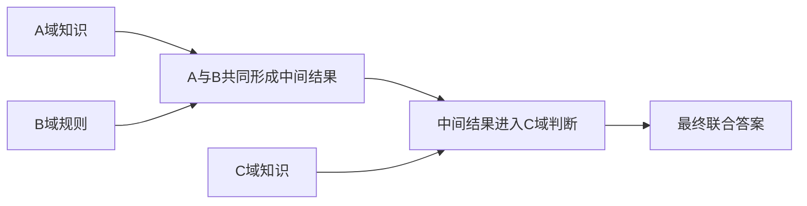

> 分享副本：保留原设计讨论；当前可执行口径以verification综合指南和各指标README为准。待确认/历史提案不代表已实施。原始pipeline、atomic、PPT及工作区归档未随包提供。

# CDN：跨域必要性的逐领域遮蔽评测与论文呈现

日期：2026-10-05。对象：`cross-x/knowledge/pipielines_v4`。

**本轮完成指标设计、真实文件结构核对和样例分析；没有运行遮蔽作答实验，没有生成模型准确率或必要性通过率。**

## 1. 要验证什么，以及“证明”应如何表述

跨域必要性（Cross-domain Necessity，本文简称CDN）关注：一道声称融合A、B、C等领域的问题，是否确实需要这些领域共同参与求解；删去任一领域的信息，是否会失去完成任务所需的能力或依据。

这与前两个指标不同：DDE检查领域选择分布，KRC检查检索需求与材料的匹配，CDN检查最终问题的求解是否依赖各参与领域。

需要区分三个强度不同的结论：

| 层次 | 检查内容 | 可以得出的结论 |
|---|---|---|
| 结构依赖审计 | 领域知识是否进入关键推理步骤，能否被题干、其他材料或选项替代 | 发现必要性缺口或潜在捷径 |
| 遮蔽作答实验 | 固定求解器和任务，逐域删去外部证据，比较表现 | 给定求解器在该协议下对领域证据的依赖 |
| 封闭信息的不可判定见证 | 剩余可见信息完全相同，却存在两个合法的不同答案 | 在规定信息与背景假设下，剩余信息不足以唯一确定答案 |

**“某模型mask后答错”不能单独证明“任何模型都无法解答”，更不能证明模型已经忘掉某个领域。** 推荐正文首先报告可复现的领域证据依赖；需要更强结论时，再提供人工核验或形式化的不可判定见证。

## 2. 输入应使用最终问题阶段

评测输入为：

```text
/home/zhangpengyue/benchmark/cross-x/knowledge/pipielines_v4/outputs/4_generate_fusion_question/
```

不能直接对阶段3的检索分数计算CDN。必须使用最终问题，因为阶段4会收敛方案、改写需求和选择实际材料。

本轮只读统计确认：

| 总参与领域数k | easy题数 | medium题数 | hard题数 | 合计 |
|---|---:|---:|---:|---:|
| 2 | 692 | 692 | 692 | 2076 |
| 3 | 696 | 696 | 696 | 2088 |
| 4 | 697 | 697 | 697 | 2091 |
| 合计 | 2085 | 2085 | 2085 | 6255 |

这些是已生成题目数量，不是已通过独立质量验收的数量。检查到所有记录的 `used_samples` 领域键与 `fusion_domains` 一致，但这只证明字段齐全，不证明领域必要。

| 字段 | CDN用途 |
|---|---|
| source_domain、fusion_domains、domain_count | 构造完整领域集合S，包含源领域 |
| sample | 源领域证据来源 |
| used_samples | 新增领域实际使用材料；优先于全部检索候选 |
| question、options | 求解器看到的最终任务 |
| answer | 隐藏的评分答案，不能放进求解输入 |
| explanation、distractor_analysis | 审计者分析领域作用与捷径；不能作为求解提示 |
| question_plan、answer_plans、required_key_facts、plan_adjustment | 审计上下文，不默认暴露给求解器 |
| difficulty | 分层报告easy/medium/hard，不把难度标签作为解题提示 |

`missing_domain_knowledge`干扰项只是生成器设计的一种错误类型，不是实际执行了该领域遮蔽，更不是一次真实失败记录。每题通常只标一个此类干扰项，不能代替对全部k个领域的逐一测试。

## 3. 首先进行结构依赖审计

每题建立“领域→知识→推理步骤→输出”的可追溯表：

| 领域 | 必要知识/规则 | 来源片段 | 参与的推理步骤 | 影响的答案部分 | 可替代路径 |
|---|---|---|---|---|---|
| A（源领域） | 待标注 | sample中的有效知识 | 中间结论z_A | 待标注 | 题干/选项是否已经给出 |
| B | 待标注 | used_samples[B] | 使用z_A形成z_AB | 待标注 | 其他领域材料是否重复提供 |
| C（若参与） | 待标注 | used_samples[C] | 使用前序结果完成判断 | 待标注 | 是否只是独立附加小问 |
| D（若参与） | 待标注 | used_samples[D] | 待标注 | 待标注 | 待标注 |

需要回答：

- 该领域提供的是任务必需规则，还是背景名词？
- 它是否影响最终答案的正确性或候选区分？
- 一域的中间结果是否被另一域的步骤真正使用？
- 删除该领域后，题干、其他材料、选项是否仍完整提供相同知识？
- 任务是否只是若干独立子问题答案的拼接？

下图是希望审计到的连接式推理示意，不是对现有每条题目的事实认定：



**每个领域都影响联合得分，并不自动证明真正融合。** 若A、B只是两个独立小题，删去任何一个都会使“全部答对”失败，但仍可能缺少跨域推理连接。因此结构依赖与遮蔽实验需要共同呈现。

### 当前文件中的真实风险例子

三域IPv4题：computer_science/test_domain_count_3.jsonl，第1行（原工作区来源，未随包提供：`cross-x/knowledge/pipielines_v4/outputs/4_generate_fusion_question/computer_science/test_domain_count_3.jsonl:1`）。参与领域为计算机、数学、金融。

- 四个选项都以“False”开头，对“IPv4首部长度恒定”的判断完全相同。
- 题干已经给出20/32字节首部、传输速率、固定费和每分钟费用。
- 这提示：仅作四选一时，判断IPv4首部是否可变，可能不再提供选项区分能力；收费公式也可能从题干直接恢复。

四域IPv4题：computer_science/test_domain_count_4.jsonl，第1行（原工作区来源，未随包提供：`cross-x/knowledge/pipielines_v4/outputs/4_generate_fusion_question/computer_science/test_domain_count_4.jsonl:1`）。参与领域为计算机、数学、金融、法律。

- 题干已给出申诉时限条款及其在本题中的适用前提。
- 四个选项均给出相同的“Other”分类和超期处理结论。
- 这提示条款分类本身可能无法区分选项；但某个选项还涉及法律结论与费用差额的关系，不能仅凭标签一致就断言整个法律领域不必要。

上述属于**基于文本的捷径风险分析，尚无实际mask作答结果**；本文不评价真实法律效力，也不把生成器的解释视为独立事实验证。

## 4. 必须区分两种mask

| 协议 | 删除什么 | 保持什么 | 结论范围 |
|---|---|---|---|
| Evidence Mask，主行为实验 | 某领域外部证据卡片 | 原题、选项、任务形式 | 求解器对该域证据的依赖 |
| Task-information Mask，补充信息审计 | 题目中某域知识/条件及所有可见重复信息 | 明确定义的剩余信息与任务版本 | 剩余信息是否足以唯一确定答案 |

不能在同一张准确率表中混合这两种协议。

以下操作均不足以代表真正遮蔽：只删除领域名称；只删一条材料而保留同域其他材料；在提示词里要求模型“不要用数学”；把通用模型称作“不懂金融的模型”。

删除数字通常只证明该数字必要，不单独证明该领域知识必要。基本算术也常是求解器背景能力，不能把“没看数学材料”直接等同于“不具备数学能力”。

## 5. Evidence Mask如何构造

### 5.1 领域证据卡片

对题i，完整领域集合为：

\[
S_i=\{source\_domain_i\}\cup fusion\_domains_i,\qquad |S_i|=k.
\]

每个领域对应证据集合E_id：源领域从sample获得，新增领域从最终题的used_samples[d]获得。

卡片制作应遵守：

- 只保留原始材料能够支持的知识，不能借机添加最终题的推理答案。
- 原子材料若为选择题，不能只保留答案字母，也不能把全部干扰选项当成事实。应关联正确选项的内容，并保留适用条件和来源。
- 源材料的completion作为原子知识可以使用；最终融合题的answer、explanation等评分信息不能使用。两者必须区分。
- 若模型或人工将材料整理成卡片，保存原文、卡片、转换版本与来源位置，检查是否添加知识或遗漏条件。
- 同领域有多条材料时，mask必须删除其全部卡片。
- 其他领域卡片可能含相同知识，需记录“跨域重复/共享知识”。不能一边保留重复知识，一边声称该知识完全被移除。
- 检查所有条件是否在上下文窗口内完整呈现，不允许Full被截断、mask反而不被截断。

保留原子QA原文也可作为独立版本运行，但要说明其中有干扰项和答案标签；不能把这种版本与经过整理的知识卡片版本混用。

### 5.2 每道题的条件

| 条件 | 求解输入 |
|---|---|
| Full | 题干＋选项＋全部k域证据 |
| −A | 同一题干与选项＋移除源领域A的全部证据 |
| −B | 同一题干与选项＋移除B域全部证据 |
| −C、−D | 对实际参与的其他领域各做一次 |
| NoEvidence | 仅题干与选项 |

**源领域也必须遮蔽。** 不能只测试新增的k−1个领域。

| 融合规模 | Full | 单域mask个数 | NoEvidence | 基础条件总数 |
|---|---:|---:|---:|---:|
| 双域A+B | 1 | 2 | 1 | 4 |
| 三域A+B+C | 1 | 3 | 1 | 5 |
| 四域A+B+C+D | 1 | 4 | 1 | 6 |

可增加OptionsOnly作为选项捷径诊断：只给四个选项，不给题干和证据。另可设置经过核验的无关材料删除或中性长度对照，用于区分领域信息作用与长度/格式影响。它们是补充条件，不并入基础条件数；中性文本也不保证完全无干扰。

### 5.3 任务形式保持一致

主实验用原始四选一，Full和所有mask保持相同题干、选项内容和输出格式；评分器单独保存gold。

建议另做结构化开放回答补充，要求输出领域相关中间结果和最终答案，减少选项泄露。但这是独立任务版本，必须对Full和所有mask一起转换，并事先定义评分规则；不能只给mask改成更难的开放题。

可保存可核验的简短中间结果或证据ID，不必索取长篇思维链，也不能仅凭模型自述“我需要某领域”就判定必要。

## 6. 固定求解与评分协议

- 使用固定求解器版本、系统提示、解码设置和输出预算。先做一个模型的试运行，正式实验尽量用至少两个独立求解器分别报告。
- 求解器不能看到gold、最终解释、错误选项类型、必要性标签或审计结论。
- mask_domain等实验标签只保存在审计元数据中，不通过“你缺少某领域知识”等提示暗示答案。各条件沿用同一预先固定的证据顺序，mask只删除指定材料。
- 允许输出选项ID或明确的ABSTAIN；ABSTAIN在原任务准确率中不算答对，但单独报告，不能与模型服务失败混在一起。
- 每题预先生成四个位置均衡的选项排列，例如循环移位，使原正确答案各处于A/B/C/D一次。每个排列在Full和全部mask条件间严格配对。
- 评分根据选项内容身份映射，不把原始字母当作重排后的gold。证据不能携带最终选项字母。
- 若选项包含“上述全部”或引用“选项A”等位置相关内容，不能机械重排；先生成语义等价、引用一致的独立版本，或标记不适合位置重排并报告数量。
- 这些排列是配对的稳健性检查，不是四个独立题目。确定性解码重复同一输入也不能虚增独立样本数。
- API/本地推理故障、超时、输出未完成等记为missing，不能直接按mask答错计分。格式无效单列，预先约定处理方式。
- 题目答案错误、多解或材料事实不可靠，记invalid，由独立核验确定；不能因为Full答错就自动判题目invalid。
- 比较主条件时使用共同完成的配对试验块，报告题目有效率、试验完成率和缺失原因；不能只留下下降最大的样本。

本指标里的模型扮演“作答者”，不是给题目打分的LLM Judge；四选一答案可以程序比对。没有模型也可由盲法人工求解，但必须新增作答记录。

## 7. 兼容2/3/4域的指标公式

下面对固定求解器、固定难度与固定协议定义。有效题目集合由预先规定的有效性和完成规则确定，不以mask是否失败筛选。

令y_i,F,r∈{0,1}表示第i题、第r个配对排列下Full是否答对；y_i,−d,r为移除领域d后的正确性。对R_i个共同完成的配对试验，记：

\[
a_i(F)=\frac1{R_i}\sum_r y_{i,F,r},\qquad
a_i(-d)=\frac1{R_i}\sum_r y_{i,-d,r}.
\]

这些是观测正确率，不是模型内在成功概率的精确估计。

### 7.1 逐域下降：哪个领域确实影响求解

\[
\boxed{\Delta_{i,d}=a_i(F)-a_i(-d)}.
\]

Δ>0表示遮蔽后表现下降；Δ≈0可能是材料冗余、模型先验、题干已给出知识、选项捷径或实验不敏感；Δ<0可能是证据噪声或方差。保留负值，不截断为0。

下降乘100后以**百分点pp**呈现。例如0.90降到0.60，是30个百分点下降，不是“下降30%”。

### 7.2 平均遮蔽下降：总体依赖强度

\[
\boxed{\Delta_i^{avg}=a_i(F)-\frac1k\sum_{d\in S_i}a_i(-d)}.
\]

k=2/3/4直接代入同一公式。每题先对参与领域平均，避免四域题因为mask次数更多而获得更大权重。

### 7.3 最弱领域下降：是否存在容易省略的领域

\[
\boxed{\Delta_i^{min}=\min_{d\in S_i}\Delta_{i,d}
=a_i(F)-\max_{d\in S_i}a_i(-d)}.
\]

这是建议与Full准确率一起重点呈现的指标。若某个领域去掉后仍能答得很好，该题的最弱领域下降就小。

必须先逐题取max/min，再跨题平均；不能先平均各领域的mask表现再取最大值，因为不同题可以有不同的可省略领域。

**数值示意，非实测：** 三域题Full=1，−A=0，−B=0，−C=1，则平均下降为2/3，但最弱领域下降为0。平均下降很大仍不能支持“每个领域都必要”。

### 7.4 全部单域mask均失败：直接对应你的目标

在源领域a、融合规模k、难度h分组G内定义：

\[
\boxed{AMF_G=
\frac{\sum_{i\in G}\sum_r y_{i,F,r}\prod_{d\in S_i}(1-y_{i,-d,r})}
{\sum_{i\in G}\sum_r y_{i,F,r}}}.
\]

AMF意为All-Mask-Fail：**在Full答对的配对试验中，逐一遮蔽任一参与领域后都答错或弃答的比例。** Full也没答对的试验不能用于证明“原来可解、遮蔽后不可解”；分母为0时记N/A。

- 双域：Full答对，−A与−B都失败。
- 三域：Full答对，−A、−B、−C都失败。
- 四域：Full答对，四个单域mask都失败。

同时报告AMF的分子、Full成功分母，以及无条件联合频率J_G：

\[
J_G=\frac{\sum_{i\in G}\sum_r y_{i,F,r}\prod_d(1-y_{i,-d,r})}{\sum_{i\in G}R_i}.
\]

AMF不能脱离Full准确率单独使用。以独立均匀随机猜四选一为示意，条件于Full偶然答对，各mask都错的概率为(3/4)^k，双/三/四域分别约56.25%、42.19%、31.64%。所以较高AMF本身也可能来自猜测；实际条件未必独立，这个计算仅用于说明风险，不作为自动校正公式。

### 7.5 分组、重复与不确定性

Full Acc、NoEvidence Acc、Δavg、Δmin先在源领域内对题目平均，再对七个源领域等权宏平均，按k和difficulty分别报告。AMF先按上式求各源领域条件率，再作源领域宏平均；某组无Full成功时记N/A，不能补0或悄悄改变完整宏平均全集。

统计区间建议按源atomic进行配对聚类bootstrap，并按源领域分层；每次抽取一个atomic时保留其所有k、难度、条件和排列。不能把同一原子的三个难度或四个排列当独立样本。

小样本每源领域只有一个atomic时，分层bootstrap不能有效估计源域内变异，主要展示逐题结果；扩大样本后再给正式区间。最弱下降含max选择，受噪声和k影响，应固定重复协议，不把跨k数值差异直接解释成质量排名。

## 8. “无法完成”的更强证据：不可判定见证

若希望比“探测模型失败”更接近逻辑证明，需要固定背景知识B及合法任务空间Ω。对于遮蔽后的可见输入v，定义其允许的答案集合：

\[
\mathcal A_B(v)=\{gold(x):x\in\Omega,\ x\text{满足背景假设}B,\ visible_{-d}(x)=v\}.
\]

若能够给出两个合法实例u、v，使得：

\[
visible_{-d}(u)=visible_{-d}(v),\qquad gold(u)\ne gold(v),
\]

则剩余信息至少允许两个答案，无法唯一确定原目标答案。这证明的是**指定信息与背景假设下的信息不足**。

关键约束：

- 两个实例的全部可见内容必须相同，包括题干剩余部分、证据、选项和规则，不能只说主题相同。
- 两个不同答案必须分别合法且有可验证推导，不能通过改坏公认科学事实制造反例。
- 如果只改变一个被删数值，证明的是数值必要；如果改变合法的私有收费规则，证明的是规则信息必要，仍不是证明整个金融学科不可替代。
- 背景假设必须明确哪些常识、算术、学科知识可使用；这不等价于让真实LLM忘掉参数知识。

例如，在明确允许不同合法合同计费规则的受控任务中，遮蔽计费规则后，两种合同可能对同一传输时间给出不同费用。只有两个版本的其余可见输入完全相同时，它们才构成见证。不能把这个构造直接套到所有现有选择题上。

**Task-information Mask后原题可能不再有唯一答案。此时“信息不足”可能才是正确回应，不能机械地按原gold把它判错，并借此宣称已证明跨域必要。** 该补充实验应评价信息是否充分及见证是否合法，而非混入Evidence Mask的原题准确率。

## 9. 论文中怎么呈现

### 主表：完整表现＋平均下降＋最弱下降＋全部mask失败

| k | 难度 | 有效题数 | Full Acc | NoEvidence Acc | 平均mask Acc | Δavg（pp） | Δmin（pp） | AMF | Full成功试验数 |
|---|---|---:|---|---|---|---|---|---|---|
| 2 | 分层 | 待测 | 待测 | 待测 | 待测 | 待测 | 待测 | 待测 | 待测 |
| 3 | 分层 | 待测 | 待测 | 待测 | 待测 | 待测 | 待测 | 待测 | 待测 |
| 4 | 分层 | 待测 | 待测 | 待测 | 待测 | 待测 | 待测 | 待测 | 待测 |

补充列或附录报告invalid数量、试验完成率、结构捷径风险数、AMF分子和J。不同求解器单独成表或分面，不混成一个均值。

### 图A：Full与mask条件对照

三个面板分别表示k=2/3/4，每个面板展示Full、平均单域mask、逐题最佳mask、NoEvidence准确率。

“逐题最佳mask”是每题max_d a_i(−d)再平均，对应最容易省略的领域；Full与它的差就是Δmin。图注写清聚类区间和实际题目数。

### 图B：领域下降热图

列为七个真实领域，行为source×k或具体题目。格子为该领域被移除后的准确率下降或剩余准确率，二者择一并明确标注；色阶统一。未参与该领域的格子为灰色N/A，不能画成0。

若展示下降，应使用允许负值的发散色阶。每格附有效题数，防止在题目构成不同的情况下给领域难度排序。

### 图C：样例遮蔽矩阵与依赖表

| 题目 | Full | −源领域 | −新增域1 | −新增域2 | −新增域3 | NoEvidence |
|---|---|---|---|---|---|---|
| 双域样例 | 待测 | 待测 | 待测 | N/A | N/A | 待测 |
| 三域样例 | 待测 | 待测 | 待测 | 待测 | N/A | 待测 |
| 四域样例 | 待测 | 待测 | 待测 | 待测 | 待测 | 待测 |

每个格子展示四个配对排列的正确次数/有效次数，附一条必要推理链和真实删除片段。正文最好同时展示一个强依赖样例和一个存在可省略领域的失败样例，不能只挑成功案例。

若提供不可判定见证，另放“相同剩余输入→两个合法答案”的案例框，不与准确率表混称。

### 论文表述模板

实验前的方法描述：

> We evaluate cross-domain evidence dependence by removing the evidence associated with each participating domain, including the source domain, while keeping the question and answer choices fixed. We report full-context accuracy, mean and weakest-domain accuracy drops, and the conditional frequency of failure under every single-domain removal.

结果出来后再填数值，并限定为“在指定求解器和证据遮蔽协议下观察到的依赖”。没有完成所有领域测试、结构核验与信息见证时，不使用“证明所有领域在任何情况下均不可替代”的表述。

## 10. 建议的首轮实验规模与可离线完成的部分

先从七个源领域各抽一个在k=2/3/4均有最终题的共享atomic，固定一个难度（例如medium），共21题。不能直接假定原KRC的21个方案全部生成成功，需按身份关联阶段4并记录缺失。

每题四个平衡选项排列、每个排列运行基础条件：

\[
7\times(4+5+6)\times4=420
\]

即每个求解器420次作答，不含重试、无关证据对照或OptionsOnly。两个求解器为840次。若同时跑三个难度，则一个求解器1260次，且仍只有7个独立源atomic，不能据此声称样本量变成63个独立原子。

必要时扩展为所有领域子集：双/三/四域分别2²=4、2³=8、2⁴=16个证据条件，已经包含Full和NoEvidence，不重复追加。非单调模型表现下，逐域移除不能代替全部子集测试。

| 工作 | 仅凭当前output能否完成 |
|---|---|
| 读取最终题、定位来源、统计领域/难度 | 能 |
| 构造字段过滤、候选mask版本、选项排列、审计清单 | 能；卡片语义正确性仍需核验 |
| 基于字面一致性发现部分选项捷径 | 能做诊断，不能代替完整语义审查 |
| 计算真实Full/Mask准确率、Δ和AMF | 不能，当前缺少配对作答记录 |
| 在本机本地模型上完成作答 | 有可用模型时可以离线运行，不必外部API |
| 人工作答与信息不足见证 | 可以离线，但需新增人工核验结果 |

不能用Embedding相似度或RRF分数替代这里的作答正确性，也不能把生成器写的necessity、explanation或missing_domain标签当成已完成的遮蔽实验。

## 11. 后续实现建议保存的文件

可沿用指标前缀习惯，新增文件均使用CDN_前缀，与KRC隔离：

- `CDN_question_inventory.csv`：question_id、atomic_id、plan_id、k、difficulty、原始位置、结构有效性。
- `CDN_dependency_audit.csv`：领域、必要知识、推理步骤、输出影响、题干/选项/跨域重复风险。
- `CDN_evidence_cards.jsonl`：证据原文、卡片内容、来源ID、共享知识标记、卡片版本。
- `CDN_mask_inputs.jsonl`：完整求解输入、mask领域、保留/删除材料ID、排列映射、token数、输入哈希。
- `CDN_solver_outputs.jsonl`：模型版本、解码参数、原始回复、有效状态、预测选项内容身份。
- `CDN_scores.csv`：题目×排列×条件的正确性、弃答和missing状态；gold只进入评分端。
- `CDN_summary.csv`、`CDN_report.md`：分组Full/Mask指标、条件分母、完成率、区间和解释。
- `CDN_figures/`：真实实验后的对照图、热图与样例矩阵。

question_id应在已有atomic/plan身份上加入difficulty及运行版本。评分答案与模型输入分开保存，避免脚本直接序列化整条阶段4记录而泄漏答案。

本轮只创建本设计文档，上述代码、输入文件和实验结果均尚未生成。下一步可先做最终题结构审计与mask输入构造，再选择本地求解器或人工协议开展实际作答。
