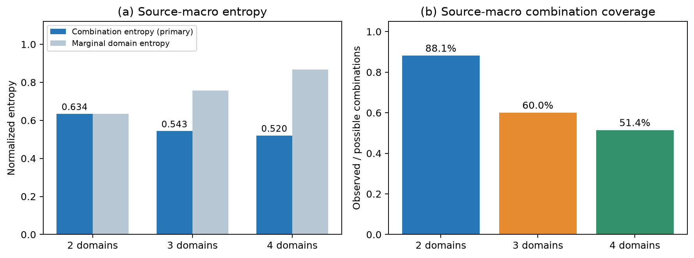
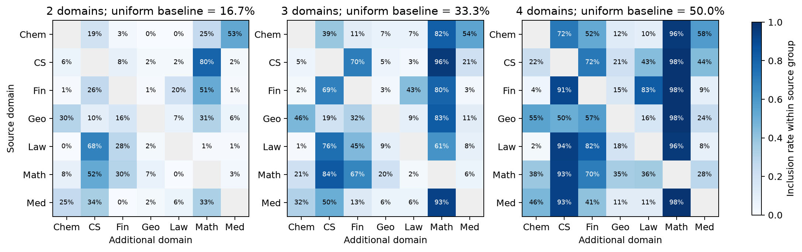
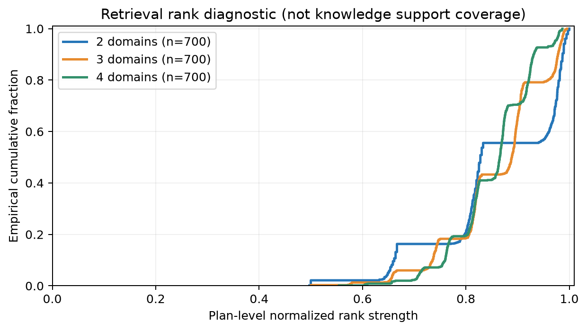

> 分享副本：保留原设计讨论；当前可执行口径以verification综合指南和各指标README为准。待确认/历史提案不代表已实施。原始pipeline、atomic、PPT及工作区归档未随包提供。

# Process Auditing：三项指标与论文呈现设计

日期：2026-10-05  
对象：现有 cross-x/knowledge/pipielines_v4/outputs  
质量检查顺序：**Process Auditing → LLM 五维统计 → Human Verification**

本文完成第一阶段的指标定义、数据对应、实验协议和论文呈现设计。领域分布与检索排名描述统计已从现有文件计算；知识支持标注及遮蔽作答实验尚未运行，文中不将它们写成已获得的结果。

## 1. 三项指标分别回答什么问题

| 指标 | 要回答的问题 | 主呈现方式 | 现有文件能直接支持到哪一步 |
|---|---|---|---|
| 领域分布熵 DDE | 从不同 atomic 源样本出发，选择了哪些新增领域组合，是否过于集中？ | 按 2/3/4 域分组的组合熵柱状图＋领域选择热图 | 可直接计算，本文提供实测图 |
| 知识需求覆盖率 KNC | 原始融合方案提出的必要知识，是否有足够的检索证据支持？方案修订后又如何？ | 覆盖率随材料预算变化的曲线＋原始/修订需求对照 | 能直接计算检索排名诊断；充分支持判断需要新增证据标注或校准的判别器 |
| 跨域必要性 CDN | 在规定的任务与探测模型下，移除任一领域的信息是否会破坏正确作答？ | Full/逐域遮蔽对照＋样本级遮蔽热图 | 需要构造遮蔽输入并新增作答实验 |

三者不要合并成一个总分。覆盖均衡、证据充分和行为上的信息依赖是不同性质的结论。

**三条解释边界：**

- 单个 atomic 在当前每个领域数下只生成一个方案，不能据此估计“该 atomic 的随机选域熵”。
- RRF、BM25、向量相似度可以描述检索行为，不能直接当作知识支持概率。
- 遮蔽外部材料不会删除模型参数中的知识。作答下降是给定协议下的证据，不能直接声称证明了任意模型都无法解决问题。

这些限制不妨碍 Process Auditing 落地，而是决定每个图的名称、分母和可支持的论文表述。

## 2. 与当前 pipeline 对齐

### 2.1 阶段与字段

| 当前阶段 | 相关字段 | 本文用途 |
|---|---|---|
| 0_extract_key_facts | source_domain、sample、key_facts、source_line | 确定 atomic 来源；核对每个领域有多少原子输入 |
| 1_generate_fusion_plans | domain_count、fusion_domains、question_plan | 统计新增领域组合；保存原始构思 |
| 2_extract_required_key_facts | required_key_facts 中的 key_fact、necessity | 保存检索前的原始需求 \(R^0\) |
| 3_retrieve_key_fact_matches | retrieved_samples、candidate_id、hits、matches、rrf_score | 保存候选证据 \(E^{ret}\)，重建每项需求的排名信号 |
| 4_generate_fusion_question | 修订后的 question_plan、required_key_facts、used_samples；question、options、answer | 保存修订需求 \(R^1\)、使用证据 \(E^{used}\)，构造作答与遮蔽输入 |

步骤 0 本身没有选择融合领域，因此它提供领域分布统计的输入基线；DDE 的实际选择记录来自步骤 1。

代码中的 domain_count 是**不同领域的总数，包含源领域**，不一定等于实际用到的原子材料条数。同一新增领域可能使用多道原子题。本文 \(k=2,3,4\) 按不同领域数分组；若论文说“2/3/4 样本融合”，应同时说明样本数和领域数是否真的相等。

### 2.2 统计单位与关联

- 原子单位：同一道源题的 prompt 和 completion。
- 方案单位：一个源题在一个指定 \(k\) 下的一次方案生成；当前是 700 个源题×3 种 \(k\)，共 2,100 个方案。
- 需求单位：某个方案、某个新增领域的一项需求。
- 最终题单位：方案的某个难度版本。当前 2,085 个方案各生成三个版本，共 6,255 道题。

建议关联标识：

\[
atomic\_id=\operatorname{SHA256}(\operatorname{canonicalJSON}(source\_domain,prompt,completion))
\]

\[
plan\_id=(atomic\_id,k,run\_id,draw\_id)
\]

\[
question\_id=(plan\_id,difficulty),\quad
requirement\_id=(plan\_id,version,domain,index)
\]

canonicalJSON 固定字段顺序与编码，不改写原始问答内容；检测近重复另做。加入 run_id、draw_id，是为了今后允许同一 atomic、同一 \(k\) 多次抽样，避免把不同方案误合并。原始需求与修订需求使用不同 version，不能仅凭 index 对齐。

阶段 1–3 的统计以方案为单位，不把三个难度版本算成三次选域或三次检索。阶段 4 的作答结果按难度分别报告；置信区间按源 atomic 聚类，重采样时保留其全部 \(k\) 与难度版本。多条题复用同一检索材料造成的相关性另做来源重叠敏感性分析。

---

## 3. 指标一：领域分布熵 Domain Distribution Entropy

### 3.1 从单个 atomic 出发，应该先画“组合路径”

当前一个 atomic 在 \(k=2,3,4\) 下各只有一个方案。以已经熟悉的 IPv4 源题为例：

| 源 atomic | \(k\) | 新增领域集合 \(B_i\) | 完整领域集合 \(S_i\) |
|---|---:|---|---|
| IPv4 首部长度是否可变 | 2 | 数学 | 计算机、数学 |
| 同一题 | 3 | 数学、金融 | 计算机、数学、金融 |
| 同一题 | 4 | 数学、金融、法律 | 计算机、数学、金融、法律 |

数据来自 双域方案（原工作区来源，未随包提供：`/home/zhangpengyue/benchmark/cross-x/knowledge/pipielines_v4/outputs/1_generate_fusion_plans/computer_science/test_domain_count_2.jsonl:1`）、三域方案（原工作区来源，未随包提供：`/home/zhangpengyue/benchmark/cross-x/knowledge/pipielines_v4/outputs/1_generate_fusion_plans/computer_science/test_domain_count_3.jsonl:1`）、四域方案（原工作区来源，未随包提供：`/home/zhangpengyue/benchmark/cross-x/knowledge/pipielines_v4/outputs/1_generate_fusion_plans/computer_science/test_domain_count_4.jsonl:1`）。

论文中的样例可用这张组合路径表，或画成三条并行分支。三条分支独立生成，不能画成暗示逐级扩展的因果链。

**不建议对每一行计算“领域均匀出现”的熵。** 若给行内每个领域分配 \(1/k\)，熵只是 \(\log k\)，归一化后恒为 1；它没有测量选域偏好。也不应把三个不同 \(k\) 的唯一结果混成同一种抽样分布。

如果以后对每个 atomic、每个固定 \(k\) 重复生成 \(R>1\) 个方案，可以估计条件于该 atomic 的组合分布并计算实例级熵。当前 \(R=1\) 时经验组合熵虽然为 0，但它只反映没有重复观察，不能解释为该 atomic 天生缺乏多样性。

### 3.2 主指标：固定源领域与领域数的组合熵

设全部领域集合为 \(\mathcal D\)，当前 \(m=|\mathcal D|=7\)。方案 \(i\) 的源领域为 \(a_i\)，完整领域集合为 \(S_i\)，新增领域集合：

\[
B_i=S_i\setminus\{a_i\},\qquad |S_i|=k,\quad |B_i|=k-1.
\]

固定源领域 \(a\) 和领域数 \(k\)，可选新增组合空间：

\[
\Omega_{a,k}=\{T\subseteq\mathcal D\setminus\{a\}:|T|=k-1\},
\qquad |\Omega_{a,k}|=\binom{m-1}{k-1}.
\]

以同源领域的一批 atomic 方案估计组合概率：

\[
\pi_{a,k}(T)=\frac{1}{N_{a,k}}
\sum_{i:a_i=a,\ |S_i|=k}\mathbf 1[B_i=T].
\]

主指标定义为：

\[
\boxed{
DDE_{a,k}=
-\frac{\sum_{T\in\Omega_{a,k}}\pi_{a,k}(T)\log\pi_{a,k}(T)}
{\log\binom{m-1}{k-1}}
}
\]

其中 \(0\log0=0\)。采用源领域等权宏平均：

\[
\boxed{DDE_k=\frac1m\sum_{a\in\mathcal D}DDE_{a,k}}.
\]

| \(k\) | 选几个新增领域 | 固定源领域后的组合数 | 归一化分母 |
|---:|---:|---:|---|
| 2 | 1 | 6 | \(\log6\) |
| 3 | 2 | 15 | \(\log15\) |
| 4 | 3 | 20 | \(\log20\) |

值为 0 表示该源领域组始终选择同一个组合；值为 1 表示全部可能组合等频出现。它反映组合覆盖与均衡程度，不是领域语义距离，也不评价融合是否合理。

分母使用预先固定的组合空间，不能用实际出现的组合数，否则只生成少数组合也可能得满分。若一个分组没有记录，标记 N/A 并报告缺失，不能默认为 0；若组合空间只有一种选择，归一化熵不适用。相同方法对比应固定 atomic 集合、样本量和领域分类体系，使用配对聚类 bootstrap 给出差异区间。

高 DDE 不是必须优化至 1 的目标。若某些组合确实不适合融合，应同时报告组合可行性或最终保留率，而不能为了提升熵强行配对。主熵的支持集不能在观察结果后只保留“成功组合”。

### 3.3 热图：具体偏向了哪些领域

定义新增领域出现率：

\[
q_{a,k}(d)=
\frac{\#\{i:a_i=a,|S_i|=k,d\in B_i\}}{N_{a,k}},
\quad d\ne a.
\]

做三张并排的 \(7\times7\) 热图：

- 横轴：新增领域；纵轴：源领域。
- 三个面板：\(k=2,3,4\)。
- 颜色：\(q_{a,k}(d)\)，固定色阶 0–100%，对角线灰色。
- 在标题标明均匀抽取时的参照 \((k-1)/(m-1)\)，分别为 16.7%、33.3%、50%。

这些出现率每行之和为 \(k-1\)，不能直接代入 Shannon 熵。如果希望报告辅助的单领域熵，需要先令 \(p_{a,k}(d)=q_{a,k}(d)/(k-1)\)，再用 \(-\sum p\log p/\log(m-1)\)。它受选取领域数量影响，不能代替主组合熵。

补充组合覆盖率：

\[
CombCov_{a,k}=
\frac{\#\{T:\pi_{a,k}(T)>0\}}{\binom{m-1}{k-1}},
\quad CombCov_k=\frac1m\sum_a CombCov_{a,k}.
\]

### 3.4 论文图 1 与现有实测结果

推荐正文展示“组合熵＋组合覆盖率”，附图展示领域选择热图；单 atomic 的组合路径表用于解释构造过程。

| 总领域数 | 方案数 | 组合熵 DDE（主指标） | 单领域熵（辅助） | 组合覆盖率 |
|---:|---:|---:|---:|---:|
| 2 | 700 | 0.6342 | 0.6342 | 88.10% |
| 3 | 700 | 0.5434 | 0.7562 | 60.00% |
| 4 | 700 | 0.5204 | 0.8662 | 51.43% |

解释：辅助的单领域熵随 \(k\) 上升，而组合熵下降，说明更多领域并不自动带来更多样的组合选择。该结论描述当前阶段 1 的选域分布，不能直接归因于组合质量。

建议图注：

> Domain combination diversity conditioned on source domain and fusion cardinality. Entropy is normalized by the fixed combination space and macro-averaged over seven source domains. Each cardinality contains 700 plans; difficulty variants are counted once.

正式实验可分别统计“步骤 1 候选方案”和“最终独立验收通过方案”。当前 6,255 道题仅代表已生成集合，不能直接称为独立验收通过集合；后者需要等待后续验收。

---

## 4. 指标二：知识需求覆盖率 Knowledge Need Coverage

### 4.1 必须拆开两个层次

**层次 A：检索排名诊断。** 现有 score 能告诉我们材料在检索列表中如何排序，是否有保留下来的候选命中各项查询。

**层次 B：语义支持覆盖。** 材料是否足以提供需求所需的概念、规则或机制，需要检查证据内容。

论文主指标 KNC 应属于层次 B；层次 A 作为定位检索问题的辅助图。即使将 RRF 归一化为 0–1，也不能把它改称“支持概率”或“知识需求覆盖率”。

该区分符合 RRF 原始工作的定位：它融合排名，而不是判断证据蕴含关系。[Cormack et al., 2009](https://cormack.uwaterloo.ca/cormack/cormacksigir09-rrf.pdf)

### 4.2 现有三个 score 分别是什么

| 字段 | 含义 | 为什么不能直接当覆盖率 |
|---|---|---|
| hits 中 method=bm25 的 score | 词语匹配相关性 | 分数尺度受查询与语料影响，非概率 |
| hits 中 method=embedding 的 score | 向量相似度 | 相近的概念不一定构成足够证据；相似度不是蕴含概率 |
| 候选顶层 rrf_score | 该候选跨查询、跨检索方法的倒数排名总和 | 会累加不同需求的命中，掩盖具体哪项需求缺口 |

当前每个新增领域有三条查询，使用 BM25 和 embedding 两种方法，RRF 常数为 60：

\[
RRF_i(d,c)
=\sum_{j=1}^{3}\sum_{h\in\{\mathrm{BM25},\mathrm{Dense}\}}
\frac{\mathbf 1[c\text{ 出现在查询 }j\text{ 的方法 }h\text{ 列表中}]}
{60+rank_{i,d,j,h}(c)}.
\]

这里的 RRF 在**每个新增领域内部**计算。当前三条查询、两种方法固定，因此不能说单个候选的 RRF 会仅仅因为 \(k\) 增大而自动变大；但直接跨新增领域求和会引入数量效应。

实现依据：融合排名函数（原工作区来源，未随包提供：`/home/zhangpengyue/benchmark/cross-x/knowledge/pipelines/3_retrieve_knowledge.py:104`）、需求转换（原工作区来源，未随包提供：`/home/zhangpengyue/benchmark/cross-x/knowledge/pipielines_v4/_pipeline_common.py:95`）。

### 4.3 如何把 score 统一成可比较的检索诊断指标

推荐从候选的 hits 按 query_index 拆回每一项需求，不直接使用跨需求累加后的 rrf_score。

令检索方法集合为 \(\mathcal H\)，当前 \(|\mathcal H|=2\)，\(\kappa=60\)。对于需求 \(r_{i,d,j}\) 与候选 \(c\)：

\[
\boxed{
u_{i,d,j,c}
=\frac{\kappa+1}{|\mathcal H|}
\sum_{h\in\mathcal H}
\frac{\mathbf 1[\text{该 query 与 method 有候选 }c\text{ 的 hit}]}
{\kappa+rank_{i,d,j,h}(c)}
}
\]

这是按理论最大值归一化的**需求级排名强度**，范围 0–1。

- 两种方法均把该候选排第一：\(u=1\)。
- 仅一种方法排第一、另一种没有命中记录：\(u=0.5\)。
- 保留候选中没有该需求的任何命中：对应值为 0。

分母固定为配置中使用的方法数，不能因为某种方法返回空结果就缩小分母。若整个实验切换为仅 BM25，应作为另一种配置分别报告。

对一个需求，取当前保留候选里的最佳排名强度：

\[
s_{i,d,j}=\max_{c\in E^{ret}_{i,d}}u_{i,d,j,c},
\qquad \max\varnothing=0.
\]

方案级使用两层平均以兼容不同 \(k\)：

\[
\boxed{
RS_i=
\frac1{k-1}\sum_{d\in B_i}
\frac1{|R^0_{i,d}|}\sum_j s_{i,d,j}
}
\]

当前每域恰好三项需求，两层平均也等于全部需求的均值；保留两层形式是为了今后需求数量可变时仍让各域等权。

**为什么只是诊断：** \(\kappa=60\) 且仅保存 top-10 时，同一方法从排名 1 到 10 的贡献差别很小；这个分数很大程度上反映两种检索是否一致。高分材料仍可能答非所问。对每个集合单独做 min–max、softmax 或把余弦线性缩放到 0–1，同样不能获得支持概率。

现有 JSONL 只保存领域融合排序后保留的候选，不是每条查询的全部原始列表。缺失 hit 的 0 仅指在当前保存结果中不可见，不表示全语料不存在支持。不能用该文件声称已计算全语料召回率。

### 4.4 可以立即画出的图：排名强度 ECDF

横轴为方案级 \(RS_i\)，纵轴为不超过该值的方案比例，分别画 \(k=2,3,4\) 三条经验累积分布曲线。这个图不需要设置任意“覆盖阈值”，适合描述当前检索行为。

| 总领域数 | 方案级排名强度均值 | 中位数 | 第 10–90 百分位 | 当前保留候选中无 hit 的需求占比 |
|---:|---:|---:|---|---:|
| 2 | 0.8583 | 0.8280 | 0.6614–0.9871 | 0.143% |
| 3 | 0.8587 | 0.8888 | 0.7357–0.9783 | 0.000% |
| 4 | 0.8513 | 0.8657 | 0.7600–0.9313 | 0.063% |

每个 \(k\) 都有 700 个方案，但需求总数分别为 2,100、4,200、6,300。主曲线以方案为统计单位，避免四域因需求更多而获得更大权重。

建议图注明确写：

> Distribution of normalized query-level rank strength aggregated per plan. This diagnostic uses retained retrieval hits only and does not measure semantic support or factual correctness.

### 4.5 真正的 KNC：对需求检查证据集合是否充分

对一项需求，需要联合读：

- 原始 question_plan，确定任务上下文；
- key_fact 与 necessity，明确要支持的规则及条件；
- 对应领域的候选问答材料；
- 候选题的正确答案，而不是把题干中的所有干扰项当事实。

不要求材料与新题数字逐字一致。若材料提供可正确迁移的规则，且新题的业务数字是清楚给定的条件，可以构成支持；不能把模型自行编造的领域规则当作“给定条件”来掩盖知识缺口。

对证据集合 \(E\) 定义支持标签：

| 标签 | 判定要求 |
|---|---|
| full | 给出了需求所需的规则、适用条件和关键关系；必要时多条材料共同构成支持 |
| partial | 只提供部分知识，仍缺关键条件、规则或连接 |
| unsupported | 无相关支持，只有主题或词语相似也归入这一类 |
| contradicted | 可信的答案/证据与需求所依赖的知识发生冲突 |
| unresolved | 信息或判断不足，暂时无法可靠归类 |

主指标只把 full 计为 1。partial 不机械赋 0.5，因为“缺一半措辞”和“缺唯一关键规则”不具有统一严重程度。多份材料可能共同支持一个需求，不能仅通过“是否存在某一条完整支持材料”来判定。

令 \(z(r,E)=\mathbf1[\operatorname{support}(r,E)=full]\)，在所有需求均完成判定时：

\[
C_{i,d}(R,E)=\frac1{|R_{i,d}|}\sum_{r\in R_{i,d}}z(r,E_{i,d}),
\]

\[
\boxed{
KNC_i(R,E)=\frac1{k-1}\sum_{d\in B_i}C_{i,d}(R,E)
}
\]

汇总时先在各源领域内平均，再对源领域宏平均，分别报告 \(k=2,3,4\)。同时报告：

\[
AllCovered_k=
\frac{\#\{i:|S_i|=k,\ \forall d,j,\ z(r_{i,d,j},E_{i,d})=1\}}{N_k},
\]

\[
WeakestDomain_i=\min_{d\in B_i}C_{i,d}(R,E).
\]

KNC 反映平均需求覆盖；AllCovered 反映没有任何已列需求缺口的方案比例；WeakestDomain 暴露最薄弱领域。随着 \(k\) 增加，AllCovered 的要求自然更严格，因此需要与 KNC 和需求数一起解释。

若有 unresolved，报告审查完成率，并给出下界（未决全部按不覆盖）与上界（未决全部按覆盖）。不能删除难判样本后只报一个看似提高的覆盖率，也不能把审查失败伪装成 unsupported。

**当前阶段的边界：** 该 KNC 只检查“方案列出的需求”被支持多少，不能发现所有未列出的必要知识，更不能直接保证源材料事实正确；需求漏项、源事实错误留给后续五维评价和人工核验，或另设专项审查。

可以用独立的证据判别器/NLI/LLM 执行这项窄任务，但必须返回证据引用、标签和缺口，并用独立标注子集校准。这属于 Process Auditing 的证据对应检查，不等同于后续对最终题目的五维整体评分。若第一阶段要求完全不调用任何语义判断模型，则当前只能完成排名诊断和构建待审核表，不能宣称完成语义 KNC。

“检索到/引用了材料”与“内容被材料支持”分开评价的思路可参考 [ALCE, Gao et al., 2023](https://aclanthology.org/2023.emnlp-main.398/)。本文具体需求覆盖定义是针对本 pipeline 的操作化设计。

### 4.6 方案收敛时，固定需求与改变需求必须分开

定义：

- \(R^0\)：步骤 2 原始需求；
- \(R^1\)：步骤 4 修订需求；
- \(E^{ret}\)：步骤 3 全部保留候选；
- \(E^{sel}\)：步骤 4 筛选后实际交给生成器的材料；
- \(E^{used}\)：最终记录声明使用的材料。

建议展示四种审计口径：

| 口径 | 计算 | 回答什么 | 当前数据可用性 |
|---|---|---|---|
| 原始需求检索覆盖 | \(KNC(R^0,E^{ret})\) | Need-first 检索满足了最初多少需求？ | 字段齐全，需支持判断 |
| 原始需求筛选后覆盖 | \(KNC(R^0,E^{sel})\) | 保持需求不变时，筛选是否丢失必要证据？ | 需恢复筛选记录或补记 Esel |
| 修订需求收敛覆盖 | \(KNC(R^1,E^{sel})\) | 修订后方案是否由选中材料支持？ | 同上 |
| 最终使用材料覆盖 | \(KNC(R^1,E^{used})\) | 最终声明使用的材料是否支持修订需求？ | 字段齐全，需支持判断 |

最终 JSONL 的 retrieved_samples 保存全部候选，used_samples 是最终声明使用材料；二者均不能自动等同于 Esel。筛选得到的 selected_samples 在普通最终 JSONL 中不是独立字段；若审计日志可恢复则读取，否则标记缺失。三个难度版本 used_samples 的并集也只能作为近似，不能冒充精确的 Esel。

修订需求没有重新检索时，不能把步骤 3 的 query_index 和 score 配到步骤 4 同序号的需求上。它们可能已变成不同概念。

同一证据集合下，修订需求更容易被覆盖，可能只是需求被替换，不是检索变好了。因此同时保存需求对应关系：保留、合理细化、删除、新增、替换；在“保留且语义等价的需求子集”上再做配对比较，并报告该子集大小。删除需求不能简单当作提高覆盖率。

真实例子：四领域 IPv4 方案的原始法律需求是“补充协议优先、载荷收费”，最终变成“一年提交期限、Other 类别”。两组需求不是同一问题，不能只报告最终覆盖并称原始法律检索成功。参见 原始需求（原工作区来源，未随包提供：`/home/zhangpengyue/benchmark/cross-x/knowledge/pipielines_v4/outputs/2_extract_required_key_facts/computer_science/test_domain_count_4.jsonl:1`） 与 修订后的最终记录（原工作区来源，未随包提供：`/home/zhangpengyue/benchmark/cross-x/knowledge/pipielines_v4/outputs/4_generate_fusion_question/computer_science/test_domain_count_4.jsonl:1`）。

### 4.7 论文图 2 的正式版本

完成支持标注后，建议用两个主面板：

**图 2a：KNC 随检索预算的变化。**

- 横轴：每个新增领域保留的前 \(t\) 个候选，建议 \(t=1,3,5,10\)。
- 纵轴：原始需求的宏平均 KNC，0–100%。
- 三条曲线：双域、三域、四域。
- 候选顺序使用当前按领域聚合的 RRF 列表，不冒称“每项需求自己的完整 top-t”。
- 每个证据前缀独立判断能否支持该需求，或由已验证的最小支持材料集合判断；不按引用数量代替支持。
- 相同 t 表示相同的每域预算；同时标明总预算为 \(t(k-1)\)。若比较检索效率，再补充总材料数或总 token 预算相同的结果。
- 置信区间按 atomic 聚类。模型判断若违反明显的支持集合一致性，应回查，而不是静默把曲线改成单调。

**图 2b：不同 \(k\) 下的原始需求覆盖、修订需求覆盖及 AllCovered。**

原始与修订口径使用清楚不同的颜色，并标注需求变化比例。凡缺 Esel 的列暂不画，或明确使用 Eused 并改标签。

附录放排名强度 ECDF 和“排名强度区间—人工充分支持比例”的校准图。后者需独立标注数据与样本量，不能在同一批测试数据上选阈值又报告性能。若要把 score 映射成概率，应在独立开发集拟合和验证校准模型，名称仍为“估计支持概率”，不等于直接测得的覆盖率。

---

## 5. 指标三：跨域必要性 Cross-domain Necessity

### 5.1 先固定“mask 掉一个领域”到底删什么

不要把两种不同实验混在一张主图中：

| 实验 | 删除对象 | 能支持的结论 |
|---|---|---|
| Evidence Mask（建议主行为实验） | 一个领域的外部证据卡片，原题与答案选项保持一致 | 该模型在此协议下对该域外部证据的依赖 |
| Task-information Mask（补充审查） | 原题中某领域负责的必要条件/信息，以及其他位置重复泄漏该信息的片段 | 修改后的受控任务是否失去足够信息 |

删除领域名称标签通常无效。删除 external evidence 不等于模型忘掉该领域。单领域微调模型也不是只具有该领域知识，不能当作严格的知识遮蔽。

单纯遮蔽价格或包数使算式无法计算，只证明这些输入必要，不能单独证明金融或计算机领域知识必要。因此应标出被遮蔽的是领域规则、适用条件、领域中间结论，还是普通题设数值，并分开解释。

### 5.2 先检查当前选择题是否有无需该领域的路径

对每道题建立一个简短的“领域—必要知识—推理步骤—影响答案”表。标明真正的跨域连接，不能把几个独立子题的答案拼接本身视作整合。

当前 IPv4 三域题的全部选项都把“首部恒定”判为 False；仅靠该项无法区分选项。四域题各选项也都给出 Other 和超期结论；它们不一定迫使模型重新掌握条款分类知识。应把这些记为选择题的领域捷径风险，而不是直接给该领域必要性通过。

相关记录：三域最终题（原工作区来源，未随包提供：`/home/zhangpengyue/benchmark/cross-x/knowledge/pipielines_v4/outputs/4_generate_fusion_question/computer_science/test_domain_count_3.jsonl:1`）、四域最终题（原工作区来源，未随包提供：`/home/zhangpengyue/benchmark/cross-x/knowledge/pipielines_v4/outputs/4_generate_fusion_question/computer_science/test_domain_count_4.jsonl:1`）。

如果改为结构化开放回答，会减少从选项猜测的机会，但它是另一个任务版本，需单独报告，并为每个答案字段定义评分规则。不能只在遮蔽条件改成开放题、Full 条件保留四选一。

要求每个领域都影响联合得分，也不自动保证跨域整合：独立多任务的合取得分同样会因删去任一子任务信息而下降。结构审查与行为遮蔽相互补充。连接式推理检查可参考 [MuSiQue, Trivedi et al., 2022](https://aclanthology.org/2022.tacl-1.31/)。

### 5.3 Evidence Mask 的可复现实验协议

**准备输入。**

- 为最终题创建领域证据卡片 \(E_{i,d}\)。源领域来自 sample，新增领域来自经核验的 used_samples；不能漏掉源领域。
- 卡片只保留有依据的知识，不带原子题选项字母，不加入最终题的 answer、explanation、distractor_analysis、answer_plans 或必要性评价结果。
- 若一个领域有多份材料，遮蔽时删除该领域全部卡片；检查其他卡片是否重复透露同一知识。
- 一条事实确实跨域共有时，标注共享性，不能仅按文件夹标签任意划分并宣称独占。
- 记录 token 数、删除片段和卡片版本，方便追溯。

**每道题的条件。**

| 条件 | 内容 |
|---|---|
| Full | 原题＋所有参与领域证据 |
| −\(d\) | 原题＋去掉领域 \(d\) 的所有证据；对每个参与领域各做一次 |
| NoEvidence | 只有原题和选项，无领域证据 |
| Control | 删除经确认不影响答案的材料，或以等长度中性内容替换被删材料，作为长度/格式敏感性的补充对照 |

Full 加逐域遮蔽分别是 3、4、5 个条件；加入 NoEvidence 后是 4、5、6 个条件。Control 单独计数。长度对照也需检查是否意外引入提示或干扰，不把它当完美控制。

优先做逐域移除；若要考察所有真子集捷径，双域、三域、四域包括空集合在内分别有 4、8、16 种子集条件。模型表现未必随证据增加而单调，逐域移除不能替代全部子集实验。

**控制条件。**

- 固定探测模型版本、解码参数、输出预算、系统提示和评分规则。建议用至少两种独立探测模型验证结论，逐模型报告。
- 正确答案用程序比较；自由文本或多字段回答需固定评分规则并人工抽查。
- 每题先生成固定的一组答案位置均衡的选项排列。Full 与全部 mask 条件使用完全相同的排列；按答案内容映射评分。
- 当前数据存在明显答案位置偏置，应先做位置平衡再实验。不要让遮蔽图测到“固定猜 B”的能力。
- 确定性解码下反复提交相同输入不是独立重复。可用预先固定的四个平衡排列做配对重复；若再使用随机采样，记录 seed 和次数。
- 探测模型不能参与同一测试子集上的需求支持阈值调优或选择性筛题。阈值、卡片规则与评分协议在开发集固定。
- 若已有题本身答案错误或不唯一，单列 invalid，不以 Full 答错就自动归为题目错误，也不能用低能力探测器制造“mask 后失败”。

### 5.4 主数值：准确率下降与最弱领域增益

设 \(a_i(F)\) 为固定协议重复下 Full 的正确率，\(a_i(-d)\) 为移除领域 \(d\) 后的正确率。它们是实测频率，不是从一次回复估计出的精确概率。

\[
\Delta_{i,d}=a_i(F)-a_i(-d).
\]

方案内先平均各领域，得到：

\[
\Delta^{avg}_k
=\frac1{N_k}\sum_{i:|S_i|=k}
\left[a_i(F)-\frac1k\sum_{d\in S_i}a_i(-d)\right].
\]

主图同时展示：

\[
A^{Full}_k=\frac1{N_k}\sum_i a_i(F),\quad
A^{MaskMean}_k=\frac1{N_k}\sum_i\frac1k\sum_{d\in S_i}a_i(-d).
\]

用保留准确率最高的逐域遮蔽寻找最容易省略的领域：

\[
\boxed{
\Delta^{min}_k
=\frac1{N_k}\sum_i
\left[a_i(F)-\max_{d\in S_i}a_i(-d)\right]
}
\]

必须先逐题取 max 再平均，否则“不同题可省略不同领域”可能被总体均值隐藏。该最大值也会受重复次数和估计噪声影响，固定试验数并报告配对区间，不仅报告一个点估计。

解释：

- Full 高且所有逐域遮蔽都明显下降：支持此协议下各域证据有贡献。
- 某个 −d 接近 Full：存在证据冗余、模型先验知识或题目捷径，应进一步区分。
- Full 也很低：主要表明模型或任务有困难，不能据此判定领域冗余。
- NoEvidence 接近 Full：材料的外部贡献弱，但不能直接断定问题没有跨域知识需求。
- 下降为负时保留负值，可能是证据噪声、冲突或探测方差，不能截断为 0。

“所有领域均必要”可作为补充频率：

\[
AllMaskFail_k=
\frac{
\sum_{i,r}y_{i,F,r}\prod_{d\in S_i}(1-y_{i,-d,r})
}{
\sum_{i,r}y_{i,F,r}
},
\]

其中 \(y\in\{0,1\}\) 为同一次配对重复的正确性。分母为 Full 正确的试验数；分母为 0 时标记 N/A。该量表示“Full 成功时，全部单域遮蔽都失败的比例”，不是所有题的无条件通过率。

随着 \(k\) 增加，需要同时失败的条件更多，该指标自然更严格，也会受猜测和条件相关性影响，不宜单独用于跨 \(k\) 排名。报告 Full 成功数量、每个 −d 结果、NoEvidence 和置信区间。四选一均匀猜测的 25% 仅是参照，不能拿观测上的等于 25% 当作不可解证明。

### 5.5 如果要使用“无法完成”这一强表述

有限模型的失败不能证明问题在一般意义上不可解。建议论文表述为：

> Under the specified evidence-masking protocol, removing any participating domain reduces answer accuracy, with per-domain effects reported separately.

若确实希望提供“剩余信息不足以唯一确定答案”的证据，可在严格定义的封闭信息任务上构造**不可判定见证**：

\[
\exists u,v:\quad
\operatorname{visible}_{-d}(u)=\operatorname{visible}_{-d}(v),
\quad gold(u)\ne gold(v).
\]

即两个均满足保留条件的合法实例，在 mask 后输入完全相同，但正确答案不同。于是仅依据剩余输入无法唯一确定答案。

这要求明确什么知识允许作为背景、哪些变量可以变化，并验证两个实例都合法，不能编造与公认领域知识矛盾的事实。如果见证只是更换一个被删数字，结论也仅限于该数字必要。它不等于已证明需要某学科知识，更不等于真实 LLM 忘记该领域。

### 5.6 论文图 3

**图 3a：三面板配对条件对照。**

- 每个面板对应 \(k=2,3,4\)。
- 展示 Full、平均单域遮蔽、逐题最佳遮蔽、NoEvidence 的准确率。
- 用相同模型的配对连线或差值区间展示 \(\Delta^{avg}\) 与 \(\Delta^{min}\)。
- 不把不同模型混成一条均值线。

**图 3b：逐域贡献热图。**

- 行为 \(k\) 或 source×k，列为七个真实领域。
- 单元格为该领域参与题目上的平均 \(\Delta_{i,d}\)，并标注样本量。
- 因各领域涉及的题目子集不同，这个图用于定位薄弱环节；不能不控制题目组成就排名“哪个领域更难”。

**图 3c：小规模样本级遮蔽矩阵。**

- 行：预先抽取的一组题，按 \(k\) 分块。
- 列：Full、−Chem、−CS、−Fin、−Geo、−Law、−Math、−Med、NoEvidence。
- 格子：正确率 0–1；没有参与该领域的格子为灰色 N/A，不能画成 0。
- 可旁注 Full 成功但所有 −d 失败的行，展示具体的依赖模式。

当前没有运行遮蔽实验，这三张图应保留为设计规格，不填模拟准确率。待新增实验后，使用本协议生成实际数据。

---

## 6. 论文正文的最小组合

建议正文保留三组图和一张总表，附录承载详细分组：

| 图表 | 主内容 | 当前状态 |
|---|---|---|
| Figure 1 | DDE、组合覆盖率；领域热图作分图或附录 | 已从阶段 1 计算并绘图 |
| Figure 2 | 原始 KNC 随每域材料预算变化＋修订需求对照 | 支持标注待运行；现有排名强度图仅作诊断 |
| Figure 3 | Full/Mask 对照＋逐域效果 | 遮蔽实验待运行 |
| 主结果表 | 各 \(k\) 的规模、DDE、KNC、AllCovered、Full Acc、最弱领域增益 | 未实测项使用“待测”，不填 0 |

表格字段建议：

| \(k\) | 方案数 | 原始需求数 | DDE | KNC-original | AllCovered | KNC-revised-used | Full Acc | \(\Delta^{min}\) |
|---:|---:|---:|---:|---|---|---|---|---|
| 2 | 700 | 2,100 | 0.6342 | 待测 | 待测 | 待测 | 待测 | 待测 |
| 3 | 700 | 4,200 | 0.5434 | 待测 | 待测 | 待测 | 待测 | 待测 |
| 4 | 700 | 6,300 | 0.5204 | 待测 | 待测 | 待测 | 待测 | 待测 |

后续若只在抽样子集上测 KNC 或 CDN，单独列出各指标的实际样本数。不能让读者以为全部 2,100 个方案或全部 6,255 道题都已执行语义审查和遮蔽实验。

## 7. 新增审计记录的最小字段

不改写原始生成结果，建议以附加审计表记录：

| 审计表 | 最小字段 |
|---|---|
| domain_audit | atomic_id、plan_id、source_domain、k、原始/最终领域集合、运行版本 |
| requirement_audit | requirement_id、version、key_fact、necessity、对应旧需求 ID、需求变化类型 |
| evidence_audit | requirement_id、材料集合类型、candidate_ids、支持标签、逐字证据片段、缺口、判别器/审核者版本 |
| rank_audit | 原始 requirement_id、candidate_id、query_index、method、rank、原始 score、归一化排名强度 |
| mask_audit | question_id、模型版本、证据卡片、mask_domain、保留/删除片段、选项排列、答案内容、正确性、token 数、重复编号 |

所有由判别器给出的 full 必须可以回查到支持片段与必要关系；所有遮蔽结果必须可以重建当时输入。不要只保存一个最后分数。

## 8. 本轮交付与复现

本轮交付是**三个指标的设计文档，加上现有数据能直接支持的描述统计和示例图**。没有调用模型开展需求支持判定，也没有生成遮蔽作答结果。后续 LLM 五维统计和 Human Verification 的具体五维定义不在本文中另行扩展。

附属文件目录：[process_auditing_design_assets_20261005](process_auditing_design_assets_20261005)

- [描述统计 CSV](process_auditing_design_assets_20261005/descriptive_statistics.csv)
- [描述统计 JSON](process_auditing_design_assets_20261005/descriptive_statistics.json)
- [计算与绘图脚本](process_auditing_design_assets_20261005/build_audit_figures.py)
- [领域分布图 PDF](process_auditing_design_assets_20261005/figure1_domain_diversity.pdf)
- [领域选择热图 PDF](process_auditing_design_assets_20261005/figure1_domain_selection_heatmap.pdf)
- [排名强度诊断图 PDF](process_auditing_design_assets_20261005/figure2_rank_strength_diagnostic.pdf)

各图同时提供 PNG、SVG、PDF；图中文字使用英文便于论文排版，正文解释使用中文。脚本依赖 numpy、matplotlib，只读阶段 1 与阶段 3 输出；会核对 RRF 重建值、各组记录数和分数范围。

本文的 DDE、需求级排名强度、KNC 与遮蔽汇总口径是面向当前数据结构的设计。参考工作支持相应原则，不意味着这些具体名称或公式已经是跨领域评测的统一标准。
